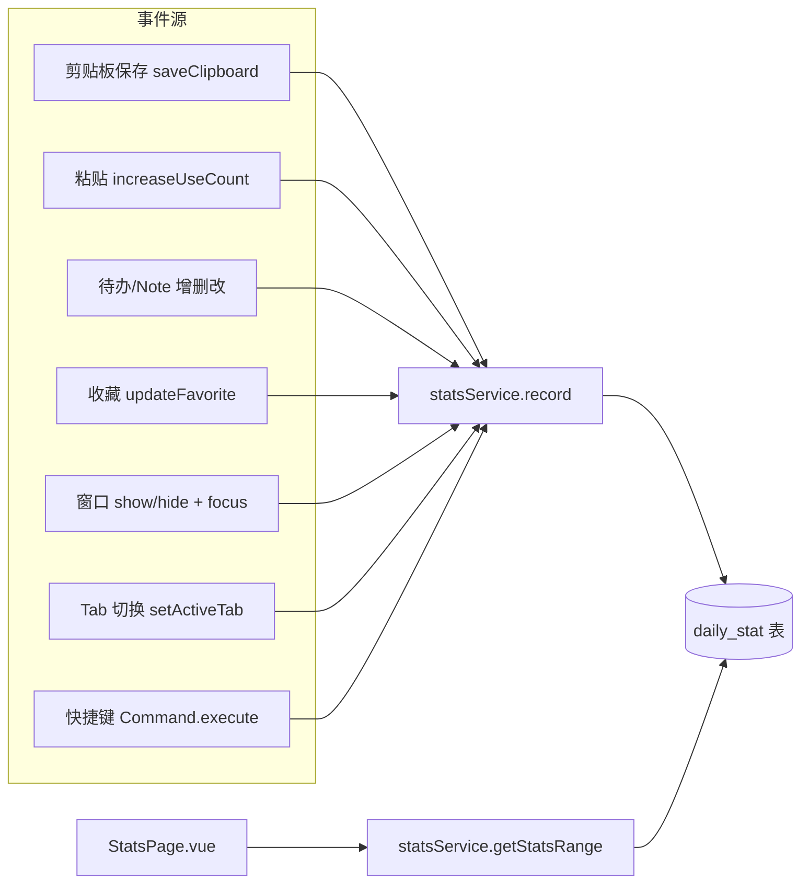
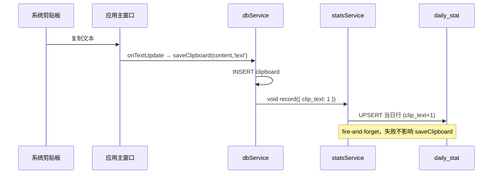

# S1d3 Board 统计模块设计文档

> 版本：v0.19（实施前设计稿）
> 日期：2026-08-26
> 状态：待评审 / 待实施
>
> **v0.2 变更（已废弃）**：原设计统计表由"永久存储"改为**受 `max_save_count` 上限保护**——达到上限时清理「最早且使用次数少」的记录（见 §3.3、§4.3）。**⚠ 该方案已被 v0.15 推翻**：经用户确认，统计表**不共用**剪贴板 `max_save_count`，改为独立精简上限（见下方 v0.15）。
> **v0.3 变更**：新增**趣味数据（Fun Stats）**——复制字数总量（`clip_chars` 列）、活跃时段自动累计（4 个时段列，`record()` 按小时自动累加）、连续使用天数/最常复制/时长换算等（见 §7.5）。
> **v0.4 变更**：新增**用户标签（User Tags）**——基于统计信息实时生成用户画像标签（数组驱动、无新表，见 §7.8）。
> **v0.5 变更**：用户标签明确为**画像型标签（非成就系统）**——移除"铁杆用户/新手上路/连续达人"等解锁式徽章，改为中性画像标签，无"解锁/里程碑"语义。
> **v0.6 变更**：用户标签**扩充为 22 项趣味命名**，命名诙谐但本质仍为中性画像，见 §7.8.1。
> **v0.7 变更**：新增**专属大标签（Unique Title）**——每个用户**唯一一个**、且**因人而异**的专属称号，由整体画像综合评分取最高，见 §7.8.4。
> **v0.8 变更**：标签全面**梗化**——小标签补充肝帝/电子仓鼠/卷王/抄作业小能手/电子榨菜/秃头程序员/时间管理大师/云监工等；大标签替换为六边形战士/复制粘贴之神/修仙党/早八战士/肝帝/收藏夹吃灰大师等，见 §7.8.1、§7.8.4。
> **v0.9 变更**：小标签判定**全部改为相对指标**（占比 / 比例 / 日均 / log），**移除绝对阈值**——如「图控 = 图片占比 > 0.5」「肝帝 = 日均使用 ≥ 4h」，使规则对不同使用强度的用户普遍适用，见 §7.8.1。
> **v0.10 变更**：新增**统计模块显示门槛（Unlock Gate）**——统计 Tab 默认不显示，仅在「活跃 ≥ 7 天 **且** 粘贴 ≥ 1000 次」后出现在标题栏（`statsService.isStatsUnlocked()` + `tabItems.gate` + `getVisibleTabItems()`），见 §7.9、§8.1。
> **v0.11 变更**：小标签**类别化展示策略**——五类各设展示上限（时段 1 / 强度 3 / 内容 3 / 功能 3 / 粘性 2），**类别内互斥**（时段画像只显示优先级最高的 1 个），每类内按 **priority** 排序截取，展示按类别分组，见 §7.8.1、§7.8.2、§7.8.3。
> **v0.12 变更**：**小标签与大标签去重**——大标签全面"称号化"改名（修仙党→夜行仙尊、电子仓鼠→仓鼠之王、卷王→卷界战神、肝帝→肝界传奇、抄作业小能手→作业天师、云监工→统计之眼），并新增「时间领主 / 灵感大师」；小标签补充「快捷键十级学者 / 灵感泉涌 / 剪贴板守卫」，见 §7.8.1、§7.8.4。
> **v0.13 变更**：**用户标签模块独立**——新增 `app/src/statistics/userTags.ts` 独立模块（规则数组 + 纯函数 `computeTags`/`computeUniqueTitle`），与 `statsService` 职责分离、依赖单向（标签层只读调用查询接口）；扩展标签仅需改规则数组，见 §7.8.0、§10.1。
> **v0.14 变更**：**标签再扩充**——小标签 +6（复制粘贴公务员/无情的剪贴机器/图片搬运工/拖更选手/全勤打卡/元老用户），大标签 +3（搬砖之王/文字炼金术士/剪贴板收藏家），保持相对指标、无重名，见 §7.8.1、§7.8.4。
> **v0.15 变更（容量策略重大调整）**：经用户确认，**统计表不再共用剪贴板 `max_save_count`**。改为**独立精简上限 `STATS_MAX_DAYS = 365`**（代码常量，默认保留最近 365 天）：① 统计表仅保留关键信息列，不存储冗余调试列；② 裁剪策略由「最早 + 使用次数少」简化为「时间窗口裁剪」——只保留最近 365 天的常用/近期记录，更早冷数据直接清理（不可恢复）；③ 统计留存与用户剪贴板设置彻底解耦。删除了 `trimDailyStat()` 对 `max_save_count` 的依赖（见 §3.2、§3.3、§4.3）。同时 §13 全部待确认项已根据用户答复标注为「✅ 已确认」（门槛 7天/1000次、标签按所选时间范围实时计算、标签规则静态数组等）。
> **v0.16 变更（标签显示门槛）**：经用户要求，**标签区仅在所选时间区间跨度 ≥ 15 天时显示**。新增 §7.8.5「标签显示门槛（Tag Span Gate）」——`TAG_MIN_SPAN_DAYS = 15`（代码常量），`computeTags/computeUniqueTitle` 入口首行判断 `daySpan(from,to) < 15` 时返回空态标记（不渲染标签，显示"样本不足 15 天"占位），与 §7.9 的 Tab 解锁门槛（7天+1000次，永久）相互独立。「日」「周」范围天然不达标，「月/年/自定义≥15天」达标。
> **v0.17 变更（容量策略再修订：不清空、仅精简存储）**：经用户要求，**统计表绝不删除用户数据**——"数据是用户宝贵的内容"。推翻 v0.15 的"独立时间窗口删除冷记录"方案，改为**两层压缩存储**：① 明细层 `daily_stat` 保留最近 `STATS_MAX_DAYS=365` 天逐日行；② 超期逐日明细由 `archiveOldStats()` **按月聚合（SUM）写入 `daily_stat_archive` 归档表（永久保留）** 后删源行，称"压缩迁移"而非删除。新增 §3.4 归档表建表 SQL（同 version 6 migration）。`getStatsRange` 改为**明细层 + 归档层 UNION ALL 聚合**（§4.4），保证"全部历史/跨年"区间的累计总量（标签依赖）精确；`getDailySeries` 超 365 天区间改用归档月稀疏柱状（§7.6）。§13 第 4、5 项同步更新为"压缩归档保留"。
> **v0.18 变更（容量策略终定：全明细永久保留，去掉归档层）**：经体积评估（一行约 190 字节，10 年仅约 690 KB），确认**无需任何裁剪或压缩**。推翻 v0.17 的"两层压缩存储"方案，改为**单表 `daily_stat` 全明细永久保留、绝不删除/归档**：① 删除 §3.4 归档表建表 SQL；② §3.3 改为"单表永久保留"说明；③ §4.3 `record()` 仅原子累加，移除 `archiveOldStats()`；④ §4.4 `getStatsRange` 回到单表 `BETWEEN` 聚合（无 UNION）；⑤ §7.6 趋势图改为全明细逐日柱状（无稀疏聚合）；⑥ §13 第 4、5 项与 v0.17 变更说明同步回退。实现最简、零信息损失，最彻底贯彻"数据宝贵、零丢失"。
> **v0.19 变更（性能与内存优化专项）**：在不改变"全明细永久保留"前提下，新增 §14 系统梳理运行期性能与内存优化，覆盖**写入合并、退出 flush 防内容损耗、存储冗余列精简、查询裁剪、趋势降采样、UI 懒加载与监听清理**六层。核心约束：① `record()` 不在每次事件直接落库，而是**内存累加器 + 周期批量 UPSERT**（写库从"事件级"降到"窗口级"）；② 监听 `beforeunload` / Tauri `onExitRequested` **强制 flush** 当日未落库累加器，杜绝崩溃丢失；③ 建表**去掉 `id` 自增列与 `updated_at`**（用 `stat_date TEXT PRIMARY KEY` 作主键，省索引 + 消除写放大）；④ 查询仅 `SELECT` 所需列、绝不 `SELECT *` 全量进内存；⑤ 超 365 天区间趋势图**按月降采样聚合**（服务端 `strftime` GROUP BY），不把上千行灌入 DOM；⑥ `StatsPage` 用 `defineAsyncComponent` 懒加载、聚合结果用 `shallowRef`、组件卸载清理定时器与 focus/blur 监听。详见 §14。

---

## 1. 需求概述

新增「统计」顶层 Tab 模块，为 S1d3 Board 提供全面的使用数据统计，帮助用户了解本软件的使用情况。

### 1.1 核心目标

| 目标 | 说明 |
|---|---|
| 独立存储 | 统计数据使用**独立数据库表**，不参与剪贴板表（`clipboard`）的 `trimClipboard` 裁剪，业务数据清空（`clearDatabase`）不影响统计 |
| 全明细永久保留 | 统计表**不读** `max_save_count`、无容量上限、绝不删除/归档（数据宝贵，零丢失，见 §3.3） |
| 多维指标 | 覆盖剪贴 / 待办 / Note / 收藏 / 使用时长 / Tab 访问 / 快捷键等全部操作 |
| 时间维度 | 每日 / 每周 / 每月 / 年度 / 自定义时间段查询 |
| 低侵入扩展 | 新增统计维度仅需「加列 + 加埋点」，无需重建表 |

### 1.2 统计维度清单（首期完整指标）

| 分类 | 指标 | 字段名 | 说明 |
|---|---|---|---|
| 剪贴板 | 新增文本剪贴 | `clip_text` | saveClipboard 插入文本时 +1 |
| 剪贴板 | 新增图片剪贴 | `clip_image` | saveClipboard 插入图片时 +1 |
| 剪贴板 | 粘贴使用次数 | `clip_use` | Enter/Ctrl+数字 粘贴时 +1 |
| 剪贴板 | 复制字符总量 | `clip_chars` | 文本剪贴时累加 `content.length`（趣味"打字量"） |
| 待办 | 新增数 | `todo_added` | 创建待办 +1 |
| 待办 | 完成数 | `todo_completed` | 切换为完成 +1 |
| 待办 | 删除数 | `todo_deleted` | 删除待办 +1 |
| Note | 新增数 | `note_added` | 创建便签 +1 |
| Note | 删除数 | `note_deleted` | 删除便签 +1 |
| 收藏 | 切换次数 | `favorite_toggle` | 收藏/取消收藏 +1 |
| 使用时长 | 可见+聚焦秒数 | `usage_seconds` | 主窗口可见且聚焦时累计（秒） |
| 快捷键 | 使用次数 | `shortcut_count` | 任意快捷键触发 +1 |
| Tab 访问 | 剪贴板/待办/便签/常用/设置/统计 | `tab_clip` 等 | 切换到某 Tab +1 |
| 趣味·时段 | 清晨/白天/晚间/深夜活跃次数 | `active_dawn` 等 | `record()` 按当前小时**自动**累加（见 §4.3），埋点无需传 |
| 趣味·换算 | 连续使用天数 / 最常复制 / 时长换算 | 无新列 | 由 daily_stat 日期序列 + clipboard 表 `count` + usage_seconds 计算（见 §7.5） |

---

## 2. 总体架构



### 2.1 设计原则

1. **独立存储**：`daily_stat` 独立于 `clipboard` 等业务表，`trimClipboard`/`clearDatabase` 都**不触碰**统计表。
2. **全明细永久保留**：统计表**不读** `max_save_count`、无容量上限、绝不删除/归档（用户 2026-08-26 终定：数据宝贵，零丢失，见 §3.3）。
3. **不阻塞主流程**：所有统计写入为 fire-and-forget（`void` 调用），内部 catch 吞异常，统计失败绝不影响业务操作；写入经 `pending` 内存累加器 + 周期 `flush()`，主流程零 DB 阻塞（见 §14.1）。
4. **最小粒度**：只存「日粒度」明细，周/月/年/自定义均由 SQL `SUM + GROUP BY` 聚合，避免多表冗余。
5. **低侵入埋点**：统计写入直接内嵌在现有业务方法内部（同层调用 `statsService`），不引入额外事件派发层。

---

## 3. 数据库设计（新增 migration version 6）

### 3.1 建表 SQL

在 `src-tauri/src/lib.rs` 的 `add_migrations("sqlite:s1d3_board.db", vec![...])` 列表末尾追加：

```rust
Migration {
    version: 6,
    description: "Create daily_stat table for permanent usage statistics",
    kind: MigrationKind::Up,
    sql: r#"
CREATE TABLE IF NOT EXISTS daily_stat
(
    stat_date       TEXT PRIMARY KEY,             -- 统计日期 YYYY-MM-DD（本地时区），一行一天
    clip_text       INTEGER NOT NULL DEFAULT 0,  -- 新增文本剪贴数
    clip_image      INTEGER NOT NULL DEFAULT 0,  -- 新增图片剪贴数
    clip_use        INTEGER NOT NULL DEFAULT 0,  -- 粘贴使用次数（Enter / Ctrl+数字）
    clip_chars      INTEGER NOT NULL DEFAULT 0,  -- 复制字符总量（文本剪贴时累加 content.length）
    todo_added      INTEGER NOT NULL DEFAULT 0,  -- 待办新增数
    todo_completed  INTEGER NOT NULL DEFAULT 0,  -- 待办完成数
    todo_deleted    INTEGER NOT NULL DEFAULT 0,  -- 待办删除数
    note_added      INTEGER NOT NULL DEFAULT 0,  -- 便签新增数
    note_deleted    INTEGER NOT NULL DEFAULT 0,  -- 便签删除数
    favorite_toggle INTEGER NOT NULL DEFAULT 0,  -- 收藏切换次数
    usage_seconds   INTEGER NOT NULL DEFAULT 0,  -- 当日窗口可见+聚焦时长（秒）
    shortcut_count  INTEGER NOT NULL DEFAULT 0,  -- 快捷键使用次数
    tab_clip        INTEGER NOT NULL DEFAULT 0,  -- 剪贴板 Tab 访问次数
    tab_todo        INTEGER NOT NULL DEFAULT 0,  -- 待办 Tab 访问次数
    tab_note        INTEGER NOT NULL DEFAULT 0,  -- 便签 Tab 访问次数
    tab_pinned      INTEGER NOT NULL DEFAULT 0,  -- 常用剪贴板 Tab 访问次数
    tab_setting     INTEGER NOT NULL DEFAULT 0,  -- 设置 Tab 访问次数
    tab_statistics  INTEGER NOT NULL DEFAULT 0,  -- 统计 Tab 访问次数
    -- ===== 趣味数据：活跃时段（record() 按当前小时自动累加）=====
    active_dawn     INTEGER NOT NULL DEFAULT 0,  -- 清晨 05:00-08:59 操作次数
    active_day      INTEGER NOT NULL DEFAULT 0,  -- 白天 09:00-17:59 操作次数
    active_evening  INTEGER NOT NULL DEFAULT 0,  -- 晚间 18:00-22:59 操作次数
    active_night    INTEGER NOT NULL DEFAULT 0,  -- 深夜 23:00-04:59 操作次数
);
"#
},
```

> **设计说明**
> - `stat_date TEXT PRIMARY KEY` 直接作主键（等价于 UNIQUE 约束），**去掉 `id` 自增列**：省去一个 8 字节/行的列与一个额外索引，写更快、存储更紧凑（见 §14.2 存储精简）。
> - **去掉 `updated_at`**：统计页不展示"最后更新时间"，消除每次写入的"写放大"（原本每 `record` 都要多更新一个字段），且减少一行约 20 字节（见 §14.2）。
> - **不建 `idx_daily_stat_date`**：`PRIMARY KEY` 在 SQLite 中本身即聚簇索引，`BETWEEN` 范围查询天然走主键，无需重复索引（见 §14.2）。
> - 所有计数列 `NOT NULL DEFAULT 0`，便于 `SUM` 聚合。
> - 新增维度 = 新加一列（`ALTER TABLE ... ADD COLUMN ... DEFAULT 0`）或直接并入 v7 migration，无需改旧表。

### 3.2 与现有表的关系

| 关系 | 说明 |
|---|---|
| 独立 | `daily_stat` 不与其他表建立外键 |
| 不受业务裁剪 | `clearDatabase()` / `trimClipboard()` 不包含 `daily_stat` |
| 独立永久保留 | 统计表**不共用**剪贴板 `max_save_count`，且**全明细永久保留、绝不删除/归档**——数据是用户宝贵内容（见 §3.3） |
| 升级 | `CREATE TABLE IF NOT EXISTS` 保证存量库升级自动建表 |

### 3.3 容量策略：全明细永久保留（无裁剪、无归档）

> **用户决策（2026-08-26 终定）**：统计表**不共用**剪贴板 `max_save_count`，且**全明细永久保留、绝不做任何删除或归档**。
>
> **体积评估**：一行日统计约 170 字节（约 22 个计数列 + `stat_date` 主键，已去除 `id` 自增列与 `updated_at`，见 §14.2）。一年 365 行 ≈ 62 KB；即便连续使用 10 年也仅约 620 KB。**完全无需裁剪或压缩**——单表永久保留在存储与查询性能上均无压力，且最彻底地贯彻"数据宝贵、零丢失"。

**实现要点**：
- `daily_stat` 单表，一日一行，`stat_date UNIQUE` 主键，逐日累计（见 §3.1）。
- `statsService.record()` 仅做 `INSERT ... ON CONFLICT(stat_date) DO UPDATE SET col = col + excluded.col` 原子累加，**无容量检查、无归档任务、无删除逻辑**。
- 范围聚合（`getStatsRange`）只查 `daily_stat` 一张表（见 §4.4），无需 UNION 归档层。
- `clearDatabase()` / `trimClipboard()` 仍不触碰 `daily_stat`。

> 此方案相比 v0.17 的"压缩归档"更简单、零信息损失，且真正做到了"绝不删除用户数据"（归档方案仍有删源行动作）。**新增维度只需在 `daily_stat` 加列，无需维护第二张表。**

## 4. 统计服务层（新增 `app/src/statistics/statsService.ts`）

> **职责边界**：`statsService` 只负责数据读写与聚合查询（record / getStatsRange / getDailySeries / 容量清理 / 使用时长累计），**不包含任何用户标签/趣味换算逻辑**。标签逻辑独立在 `userTags.ts`（见 §7.8.0）。

### 4.1 单例结构

沿用 `dbService.ts` 的单例模式（`private static instance` + `getInstance()`）。

```
app/src/statistics/
├── statsService.ts      # 数据服务（单例）：读写/聚合/容量清理/时长
└── userTags.ts          # 用户标签模块（独立）：规则 + 纯函数计算（见 §7.8.0）
```

### 4.2 核心 API

```ts
export type StatField =
  | 'clip_text' | 'clip_image' | 'clip_use' | 'clip_chars'
  | 'todo_added' | 'todo_completed' | 'todo_deleted'
  | 'note_added' | 'note_deleted' | 'favorite_toggle'
  | 'usage_seconds' | 'shortcut_count'
  | 'tab_clip' | 'tab_todo' | 'tab_note' | 'tab_pinned'
  | 'tab_setting' | 'tab_statistics'
  | 'active_dawn' | 'active_day' | 'active_evening' | 'active_night';

export interface StatsSummary {
  // 与 daily_stat 各列同名，聚合值
  [key: string]: number;
}

class StatsService {
  // 1) 当日累加（核心写入口，fire-and-forget，仅写入内存累加器，见 §14.1）
  async record(partial: Record<StatField, number>): Promise<void>;

  // 2) 查询单日
  async getDaily(date: string): Promise<StatsSummary>;

  // 3) 查询区间聚合（日/周/月/年/自定义统一走这里，仅 SELECT 所需列，见 §14.3）
  async getStatsRange(from: string, to: string): Promise<StatsSummary>;

  // 4) 查询区间内按日分组的明细（用于趋势图，见 §14.4 降采样）
  async getDailySeries(from: string, to: string): Promise<{ date: string; ... }[]>;

  // 5) 强制落库内存累加器（退出前 / 定时 flush 调用，见 §14.1）
  async flush(): Promise<void>;

  // 6) 使用时长跟踪（app.vue 主窗口调用）
  startUsageTracking(): void;
  stopUsageTracking(): void;
}

export const statsService = StatsService.getInstance();
```

### 4.3 `record()` 实现要点

```ts
// 内存累加器：按日期暂存未落库的增量，周期批量写库（见 §14.1 写入合并）
private pending = new Map<string, Partial<Record<StatField, number>>>();
private flushTimer: number | null = null;

async record(partial: Record<StatField, number>) {
  try {
    const date = this.today();               // 本地时区 YYYY-MM-DD

    // 趣味数据：按当前小时自动累加到时段列（埋点无需感知时段）
    const hour = new Date().getHours();
    const bucket = hour >= 5 && hour < 9 ? 'active_dawn'
      : hour >= 9 && hour < 18 ? 'active_day'
      : hour >= 18 && hour < 23 ? 'active_evening' : 'active_night';
    partial[bucket] = (partial[bucket] ?? 0) + 1;

    // ① 只写内存累加器，不立即落库——把"事件级"写库降到"窗口级"（§14.1）
    const acc = this.pending.get(date) ?? {};
    for (const [k, v] of Object.entries(partial)) {
      acc[k as StatField] = (acc[k as StatField] ?? 0) + v;
    }
    this.pending.set(date, acc);

    // ② 首条触发一个轻量定时器（如 2s 节流），到期批量 flush
    if (this.flushTimer == null) {
      this.flushTimer = setTimeout(() => void this.flush(), 2000);
    }
  } catch (e) {
    console.error('[stats] record failed:', e);  // 统计失败不影响业务
  }
}

// 把内存累加器一次性批量 UPSERT 落库（§14.1 周期批量 + §14.1.1 退出 flush 共用）
async flush() {
  if (this.flushTimer != null) { clearTimeout(this.flushTimer); this.flushTimer = null; }
  if (this.pending.size === 0) return;
  try {
    await this.ensureDbInitialized();
    for (const [date, acc] of this.pending) {
      const cols = Object.keys(acc).join(', ');
      const vals = Object.values(acc);
      const setClause = Object.keys(acc)
        .map((k) => `${k} = ${k} + excluded.${k}`)
        .join(', ');
      await this.db!.execute(
        `INSERT INTO daily_stat (stat_date, ${cols}) VALUES ($1, ${vals.map((_, i) => `$${i + 2}`).join(', ')})
         ON CONFLICT(stat_date) DO UPDATE SET ${setClause}`,
        [date, ...vals]
      );
    }
    this.pending.clear();
  } catch (e) {
    console.error('[stats] flush failed:', e);  // 失败保留 pending 下次重试，不丢数据
  }
}
```

> **写入合并（§14.1）**：`record()` 本身**不碰数据库**，只在内存累加器 `pending` 中合并；由 2s 节流定时器或退出事件触发 `flush()` 批量写。若同一秒发生 50 次剪贴，写库从 50 次降到 1 次，DB 压力与卡顿显著下降。
> **退出 flush（§14.1.1）**：`app.vue` 监听 `beforeunload` 与 Tauri `onExitRequested`，调用 `statsService.flush()` 强制落库，杜绝进程崩溃/强制退出导致的当日未落库数据丢失（契合"数据宝贵"核心诉求）。
> 使用 `ON CONFLICT(stat_date) DO UPDATE SET col = col + excluded.col` 实现**原子累加**，无并发竞态；不再更新 `updated_at`（已去列）。
> `daily_stat` 单表**永久保留全部逐日明细**，不读取 `max_save_count`、无归档任务、无删除逻辑（用户 2026-08-26 终定：数据宝贵，全明细零丢失）。

### 4.4 `getStatsRange()` 实现要点

> 单表永久保留，范围查询只聚合 `daily_stat` 一张表（无需 UNION 归档层）。**查询裁剪见 §14.3**——只 `SELECT` 当前页面实际展示的列，绝不 `SELECT *` 把全部列搬进内存。

```ts
async getStatsRange(from: string, to: string, fields?: StatField[]): Promise<StatsSummary> {
  await this.ensureDbInitialized();
  // 查询裁剪（§14.3）：未指定则按调用方所需字段构造 SUM 列表，避免全列 SELECT
  const sumCols = (fields ?? DEFAULT_RANGE_FIELDS)
    .map((f) => `COALESCE(SUM(${f}), 0) AS ${f}`)
    .join(', ');
  const rows = await this.db!.select(
    `SELECT ${sumCols} FROM daily_stat WHERE stat_date BETWEEN $1 AND $2`,
    [from, to]
  );
  return rows[0] as StatsSummary;
}
```

> 单表 `BETWEEN` 直接按日期字符串比较（字典序等同时间序），覆盖所选区间全部逐日明细，聚合结果即该区间累计值。聚合在数据库侧完成，**JS 端只收到一行汇总**，不把区间内所有逐日明细行载入内存（见 §14.3）。

### 4.5 `startUsageTracking()` 实现要点

- 在 `app/app.vue` 主窗口 `onMounted` 调用。
- 维护内存状态：`visible`（窗口可见）、`focused`（窗口聚焦）、`lastTick`（上次结算时间戳）。
- 监听事件（Tauri API）：
  - `getCurrentWindow().onResized` / `onMoved` 不相关；用 **`onFocusChanged`**（focused 布尔）
  - 窗口 **show/hide** 通过 `getCurrentWindow().onShow` / `onCloseRequested`？实际 Tauri 提供 `onFocusChanged` + 可见性查询。
  - 简化方案：**定时器每 30 秒结算一次**，若 `visible && focused` 则把增量秒数合并进 `pending` 累加器（`usage_seconds += elapsed`，**不在此直接落库**），由统一的 `flush()` 周期写库（见 §14.1）。
  - 监听 `onFocusChanged` 更新 `focused`；窗口 `show/hide` 通过轮询 `isVisible()` 或监听事件更新 `visible`。
- 跨日结算：若 `lastTick` 与 `now` 跨天，按比例拆分到两日（或简单归入当前日，见边界说明）；拆分后两日增量各自走 `record({usage_seconds})` 进入对应日期的 `pending`。
- **落库统一收敛到 `flush()`**：时长增量与 `record()` 其他埋点共用 `pending` 累加器与同一节流定时器，避免每个 tick 都 `execute`（见 §14.1、§14.1.1）。

---

## 5. 采集埋点清单（事件驱动植入）

所有埋点均为 `void statsService.record({...})` 形式，**fire-and-forget**。

### 5.1 剪贴板（`app/src/db/dbService.ts`）

| 位置 | 方法 | 埋点 |
|---|---|---|
| 插入新记录成功后 | `saveClipboard(content, type)` 的 `if (existingRecord.length === 0)` 分支 | `clip_text` 或 `clip_image` +1；**文本时**额外 `clip_chars + content.length` |
| 递增使用次数时 | `increaseUseCount(id)` | `clip_use` +1 |

> `clip_chars` 只在**文本**插入时累加（图片 base64 不计入"打字量"）。

### 5.2 待办

| 位置 | 方法/函数 | 埋点 |
|---|---|---|
| 创建 | `app/components/todo/TodoList.vue` 的 `addTodo`（内部调 `insertTodo`）| `todo_added` +1 |
| 完成切换 | `toggleTodo`（`todo.completed` 变为 1 时）| `todo_completed` +1 |
| 删除 | `deleteTodo`（调 `clipboardService.deleteTodo`）| `todo_deleted` +1 |

> 埋点可放在 dbService 的 `insertTodo/deleteTodo/updateTodo` 内（更统一），其中 `updateTodo` 无法区分"完成切换"与普通编辑——需在 `TodoList.toggleTodo` 处埋点更精确。**推荐**：增删在 dbService，完成切换在 TodoList。

### 5.3 Note（`app/src/db/dbService.ts`）

| 位置 | 方法 | 埋点 |
|---|---|---|
| 创建 | `insertNote(note)` | `note_added` +1 |
| 删除 | `deleteNote(noteId)` | `note_deleted` +1 |

### 5.4 收藏

| 位置 | 方法 | 埋点 |
|---|---|---|
| 收藏切换 | `dbService.updateFavorite(id, value)` | `favorite_toggle` +1 |

### 5.5 使用时长（`app/app.vue`）

| 位置 | 说明 |
|---|---|
| 主窗口 `onMounted` | 调用 `statsService.startUsageTracking()`（启动 30s 结算定时器，增量进入 `pending` 累加器） |
| 主窗口 `onBeforeUnmount` | 调用 `statsService.stopUsageTracking()`（清除定时器）+ `await statsService.flush()`（强制落库，见 §14.1.1） |
| 主窗口 `beforeunload` / Tauri `onCloseRequested`/`onExitRequested` | 调用 `statsService.flush()`（退出前兜底强制落库，防止 `pending` 未落库数据丢失，见 §14.1.1） |

### 5.6 Tab 访问（`app/composables/useTabs.ts` 或 `app/pages/index.vue`）

- 推荐在 **`useTabs.ts` 的 `setActiveTab()`** 内埋点（集中，且标题栏点击与 SwitchTabCommand 都经过它）：

```ts
export function setActiveTab(key: TabKey) {
  const prev = activeTab.value;
  activeTab.value = key;
  // 统计埋点：仅在真正切换时 +1（record 内部合并进 pending 累加器，不立即写库，见 §14.1）
  if (prev !== key) {
    void statsService.record({ [`tab_${key}`]: 1 });
  }
}
```

### 5.7 快捷键（统一入口）

推荐在 **`app/src/commands/shortcuts/ShortcutManager.ts`** 两处命中点埋点：

| 位置 | 说明 |
|---|---|
| 全局快捷键回调 `register(config.key, async (event) => {...})` | 命中后 `void statsService.record({ shortcut_count: 1 })` |
| 局部快捷键 `if (isMatch) {...}` 分支 | 命中后 `void statsService.record({ shortcut_count: 1 })` |

> 这样**覆盖全部快捷键**，无需在每个 Command 内重复埋点。

---

## 6. 使用时长跟踪详细设计

### 6.1 状态机

```
┌─────────────┐   show / focus     ┌─────────────┐
│   非活跃     │ ────────────────→  │    活跃      │
│ (visible=0   │                    │ (visible=1   │
│  or focused=0│ ←────────────────  │  and focused │
└─────────────┘   hide / blur      └─────────────┘
```

### 6.2 结算逻辑（每 30s 或事件边界）

```
tick():
  now = Date.now()
  elapsed = now - lastTick
  if (active): usage_seconds += elapsed/1000  (累积到内存)
  lastTick = now
```

- 每 30s 定时器触发 `tick()`，并将累积秒数通过 `record({ usage_seconds })` 落库后清零内存计数。
- `stopUsageTracking()` 在卸载时执行最后一次 `tick()` + 落库。
- **跨日边界**：若一次结算跨天，将秒数按当日比例拆分（或归入结算时刻所在日期，首期取后者，注释说明）。

### 6.3 依赖的 Tauri API

```ts
import { getCurrentWindow } from '@tauri-apps/api/window';

const win = getCurrentWindow();
win.onFocusChanged(({ payload: focused }) => { focusedFlag = focused; });
// 可见性：主窗口 show/hide 由全局逻辑控制；在 app.vue 中可监听
//   win.onShow(() => visibleFlag = true)
//   win.onHide(() => visibleFlag = false)
// （如 API 不支持 onHide，则用定时器轮询 isVisible() 兜底）
```

---

## 7. UI 设计（新增 `app/components/statistics/StatsPage.vue`）

### 7.1 页面结构（自上而下）

```
┌────────────────────────────────────────────┐
│  范围切换栏（glass-card）                    │
│  [每日] [每周] [每月] [年度] [自定义]        │
│  （自定义时展开：起始日期 ─ 结束日期）        │
├────────────────────────────────────────────┤
│  专属大标签（Unique Title 横幅，唯一称号）  │
│  👑 剪贴王者                                │
├────────────────────────────────────────────┤
│  我的标签（User Tags 徽章墙）               │
│  [📋剪贴狂魔] [⚡效率达人] [🌙夜猫子] ...   │
├────────────────────────────────────────────┤
│  核心指标卡片网格（2-3 列响应式）            │
│  ┌──────┐ ┌──────┐ ┌──────┐ ┌──────┐       │
│  │ 剪贴数│ │图片数│ │粘贴使用│ │待办   │       │
│  └──────┘ └──────┘ └──────┘ └──────┘       │
│  ┌──────┐ ┌──────┐ ┌──────┐ ┌──────┐       │
│  │ Note │ │收藏  │ │使用时长│ │快捷键 │       │
│  └──────┘ └──────┘ └──────┘ └──────┘       │
├────────────────────────────────────────────┤
│  Tab 访问分布（横向条形图）                  │
├────────────────────────────────────────────┤
│  趣味数据（Fun Stats）                       │
│  打字量 / 复制之王 / 连续使用 / 活跃时段     │
│  夜猫子 / 早起鸟 / 时长换算                  │
├────────────────────────────────────────────┤
│  每日趋势（CSS 柱状条）                      │
└────────────────────────────────────────────┘
```

### 7.2 范围切换逻辑

| 范围 | 起始日期 | 结束日期 |
|---|---|---|
| 每日 | 今天 | 今天 |
| 每周 | 本周一 | 今天 |
| 每月 | 本月 1 号 | 今天 |
| 年度 | 今年 1 月 1 日 | 今天 |
| 自定义 | 用户选择起止（cally 日期选择器） | 用户选择 |

> 日期计算用原生 `Date`，本地时区。`from/to` 字符串格式 `YYYY-MM-DD`。

### 7.3 指标卡片

- 图标（内联 SVG，沿用现有风格）+ 大号数值（`tabular-nums`）+ 标签。
- hover 微上浮阴影（`hover:-translate-y-1 hover:shadow-float`）。
- 使用时长格式化：`xx 小时 xx 分` / `xx 分钟` / `xx 秒`。

### 7.4 Tab 访问分布

- 横向条形：每条 = tab 名称 + 访问次数 + 占比条（金色渐变）。
- 占比 = `tab_x / Σ所有 tab 访问`。

### 7.5 趣味数据（Fun Stats）

> 数据来源：`daily_stat`（clip_chars / 时段列 / 日期序列）+ `clipboard.count` + `usage_seconds`，全部为**查询/计算**，无新增表。随所选时间范围联动。

| 趣味项 | 计算方式 | 展示 |
|---|---|---|
| 打字量 | `SUM(clip_chars)` 换算为「约 X 万字」| 大字卡片 |
| 最常复制 | `clipboard` 表 `ORDER BY count DESC LIMIT 1` 取前 N 字 | 「复制之王」卡片 |
| 最长连续使用 | `daily_stat` 日期序列中最大连续天数 | 「X 天连续使用」徽章 |
| 活跃时段 | `active_dawn/day/evening/night` 占比 | 4 段条形 + 最高时段高亮 |
| 夜猫子指数 | `active_night / Σactive` > 30% 判定 | 趣味标签「夜猫子 🌙」 |
| 早起鸟指数 | `active_dawn / Σactive` > 30% 判定 | 趣味标签「早起鸟 ☀️」 |
| 使用时长换算 | `Σusage_seconds` → 「相当于看了 X 部 2 小时电影」| 趣味文案 |

### 7.6 每日趋势

- `getDailySeries` 返回按日数组（全明细永久保留，所选区间内任意跨度均为逐日粒度）。
- CSS 柱状条（无图表库依赖）：高度按最大值归一化，hover 显示 `日期: 值`。
- **趋势降采样（§14.4）**：区间 ≤ 92 天（约一季）展示逐日柱状；超过则该区间改由服务端按 `strftime('%Y-%m', stat_date)` **按月聚合**，只返回稀疏月柱（≤ 12~24 根），避免「年/全部历史」把上千个 `<div>` 柱子常驻 DOM 造成内存/渲染压力。降采样阈值 `TREND_DOWNSAMPLE_DAYS = 92`（代码常量）。
- 单表全明细保留下，长期趋势形态仍完整（按月聚合不丢总量信息）。

### 7.7 空态与细节

- 无数据：显示"暂无统计数据"提示卡片。
- 数值等宽字体防跳动。
- 响应式：`grid-cols-1 sm:grid-cols-2 lg:grid-cols-4`。
- 复用类：`glass-card`、`btn-soft`、`bg-surface-field`、`text-ink`、`text-ink-faint`、`border-accent`、`text-gold`。

### 7.8 用户标签（User Tags）

> 根据用户统计信息**实时生成用户画像标签**（描述使用习惯/偏好的中性标签，**非成就系统**——不设"解锁""里程碑"徽章）。基于当前所选时间范围（默认「全部/累计」）的聚合值 + 阈值规则判定，规则集中配置、数组驱动，**无需新增表**。随范围切换联动刷新。

#### 7.8.0 独立模块（userTags.ts，与 statsService 解耦）

> **用户标签生成逻辑独立成模块** `app/src/statistics/userTags.ts`，与数据服务 `statsService` 职责分离，便于后续独立扩展。

```
app/src/statistics/
├── statsService.ts   # 数据服务：record / 查询聚合 / 容量清理 / 使用时长 —— 不含任何标签逻辑
└── userTags.ts       # 用户标签模块（独立）：规则定义 + 纯函数计算
```

**模块边界（依赖单向）**

```
StatsPage.vue ──▶ userTags.computeTags() / computeUniqueTitle()
                        │
                        ▼ (只读调用查询接口)
                 statsService.getStatsRange() / getDailySeries()
```

| 关注点 | statsService（数据层）| userTags（标签层）|
|---|---|---|
| 职责 | 读写 `daily_stat`、聚合查询、容量清理、时长累计 | 定义标签规则、判定命中、按类别/优先级输出 |
| 依赖 | 只依赖 Database | 只依赖 statsService 的**查询接口**（不反向）|
| 扩展 | 加统计列 + migration | 加一条规则数组项即可，无其他改动 |

**userTags.ts 结构**

```ts
// 依赖 statsService 导出的类型与查询
import type { StatsSummary } from './statsService';
import { statsService } from './statsService';

// 1) 类型
export type UserTagCategory = 'time' | 'intensity' | 'content' | 'feature' | 'stickiness';
export interface UserTag { id: string; name: string; icon: string; category: UserTagCategory }
export interface UserTagRule {
  id: string; name: string; icon: string;
  category: UserTagCategory;      // 类别
  priority: number;               // 类别内优先级（小=优先）
  condition: (stats: StatsSummary, series: DailyStatRow[]) => boolean;  // 相对指标判定
}
export interface UserTitleRule {
  id: string; name: string; icon: string;
  score: (stats: StatsSummary, series: DailyStatRow[]) => number;        // 相对归一化评分
}

// 2) 规则数组（集中配置，扩展只改这里）
export const USER_TAG_RULES: UserTagRule[] = [ /* §7.8.1 全部规则 */ ];
export const USER_TITLE_RULES: UserTitleRule[] = [ /* §7.8.4 全部规则 */ ];
export const CATEGORY_LIMIT: Record<UserTagCategory, number> = { time: 1, intensity: 3, content: 3, feature: 3, stickiness: 2 };
export const DEFAULT_TITLE: UserTag = { id: 'newbie', name: '好奇的萌新', icon: '🐣', category: 'time' };

// 3) 纯函数（输入 stats + series → 输出标签，无副作用，易测试）
export async function computeTags(from: string, to: string): Promise<UserTag[]>;      // 小标签
export async function computeUniqueTitle(from: string, to: string): Promise<UserTag>; // 专属大标签
```

> **纯函数设计**：`computeTags` / `computeUniqueTitle` 只依赖入参（stats/series）计算结果，不写库、不产生副作用，便于单元测试与复用。
> **扩展方式**：新增标签 = 在 `USER_TAG_RULES` / `USER_TITLE_RULES` 数组加一条规则，其余代码零改动；新增统计维度 = statsService 加列 + userTags 规则引用新列。

#### 7.8.1 标签规则表（首期，画像型 · 趣味命名 · 比例驱动 · 类别优先级）

> 标签只描述"用户是哪种使用习惯的人"，同一用户可同时命中多个标签。不设"成就/解锁"性质标签。
> 命名偏诙谐有趣（图控 / 文字狱 / 修仙党等），本质仍是**中性画像描述**。
> **判定一律用相对指标**（占比 / 比例 / 日均 / log），**不使用绝对阈值**（如"超过 500 次"），使规则对不同使用强度的用户普遍适用。

**类别展示策略**（用户要求）

| 类别 | 互斥 | 每类展示上限 | 说明 |
|---|---|---|---|
| ① 使用时段画像 | **互斥** | **1** | 一个用户只有一个时段身份（夜猫子/早起鸟…不并列）|
| ② 使用强度画像 | 否 | 3 | 取命中中优先级最高的 3 个 |
| ③ 内容偏好画像 | 否 | 3 | 同上 |
| ④ 功能偏好画像 | 否 | 3 | 同上 |
| ⑤ 粘性画像 | 否 | 2 | 同上 |

> 类别内标签按 **priority（数字小 = 优先）** 排序；互斥类只取优先级最高命中的 1 个，非互斥类取前 N 个（N = 该类别上限）。展示时按类别分组，类别内已按优先级排序。

**基础量定义**

```
操作总量 total = Σ 所有计数列（剪贴/粘贴/待办/Note/收藏/快捷键/时段/Tab 访问等）
活跃天数 days  = 所选范围内有统计记录的天数
日均值        = 某列总量 / days（相对化，消除活跃天数差异）
某列占比      = 某列 / total（或与配对列相比）
log10(n)      = 以 10 为底的对数（压数量级，用于"量很大"类判定）
```

**① 使用时段画像（占比 · 互斥取 1）**

| 优先级 | 标签 | 图标 | 判定规则 |
|---|---|---|---|
| 1 | 修仙党 | 🧘 | `active_night / Σactive > 0.6`（最极端，优先）|
| 2 | 夜猫子 | 🌙 | `active_night / Σactive > 0.3` |
| 3 | 打工人 | 💼 | `active_day / Σactive > 0.5` |
| 4 | 早起鸟 | ☀️ | `active_dawn / Σactive > 0.3` |
| 5 | 三班倒 | 🔄 | 四时段**最大占比 ≤ 0.4**（全天均匀）|

**② 使用强度画像（日均 / log / 占比 · 上限 3）**

| 优先级 | 标签 | 图标 | 判定规则 |
|---|---|---|---|
| 1 | 肝帝 | 🔥 | 日均使用时长 ≥ 4h |
| 2 | 电子仓鼠 | 🐹 | 日均剪贴 ≥ 60（囤积狂）|
| 3 | 卷王 | ⚡ | 快捷键占比 > 0.5 且 待办完成率 > 0.5 |
| 4 | 高频剪贴 | 📋 | 日均剪贴 ≥ 20 |
| 5 | 快捷键依赖 | ⌨️ | 快捷键占比 `shortcut_count / total > 0.3` |
| 6 | 重度使用者 | 🔋 | 日均使用时长 ≥ 1h |
| 7 | 快捷键十级学者 | 🎹 | 快捷键占比 > 0.6（比快捷键依赖更极端）|
| 8 | 复制粘贴公务员 | 🧑💼 | 粘贴占比 > 0.4（天天 Ctrl+C/V 盖章打卡）|
| 9 | 无情的剪贴机器 | 🤖 | 日均剪贴 > 30 且 粘贴占比 > 0.3（没有感情，只有复制）|

**③ 内容偏好画像（占比 · 上限 3）**

| 优先级 | 标签 | 图标 | 判定规则 |
|---|---|---|---|
| 1 | 图控 | 🖼️ | `clip_image / (clip_text + clip_image) > 0.5` |
| 2 | 文字狱 | 📜 | `clip_text / (clip_text + clip_image) > 0.7` |
| 3 | 抄作业小能手 | ✍️ | `clip_use / (clip_use + clip_text + clip_image) > 0.5` |
| 4 | 电子榨菜 | 🍿 | `log10(clip_chars) ≥ 5` 且 文字占比 > 0.6 |
| 5 | 秃头程序员 | 👨💻 | 快捷键占比 > 0.3 且 文字占比 > 0.5 |
| 6 | 图片搬运工 | 🚚 | 图片占比 > 0.4 且 日均图片 ≥ 5（专门搬运图片）|

**④ 功能偏好画像（占比 · 上限 3）**

| 优先级 | 标签 | 图标 | 判定规则 |
|---|---|---|---|
| 1 | 效率机器 | ⚙️ | 快捷键占比 > 0.2 且 待办完成率 > 0.5 且 日均 ≥ 1h |
| 2 | 时间管理大师 | 🕰️ | 待办完成率 `todo_completed / todo_added > 0.6` |
| 3 | 常用剪贴依赖者 | 📌 | `tab_pinned / Σtab > 0.3` 且 粘贴占比 > 0.3 |
| 4 | 待办狂魔 | ✅ | `(todo_added + todo_completed) / total > 0.3` |
| 5 | 便签诗人 | 🗒️ | `note_added / total > 0.3` |
| 6 | 收藏癖 | ⭐ | `favorite_toggle / total > 0.3` |
| 7 | 云监工 | 👀 | `tab_statistics / Σtab > 0.3` |
| 8 | 灵感泉涌 | 💡 | `note_added / total > 0.3` 且 文字占比 > 0.5（便签+文字双高，灵感爆棚）|
| 9 | 剪贴板守卫 | 🛡️ | `tab_clip / Σtab > 0.5`（常驻剪贴板页面）|
| 10 | 拖更选手 | ⏳ | 待办完成率 < 0.2（开了不完成，重度拖更）|

**⑤ 粘性画像（相对 · 上限 2）**

| 优先级 | 标签 | 图标 | 判定规则 |
|---|---|---|---|
| 1 | 常客 | 🏠 | 活跃天数占比 `days / 跨度天数 > 0.5` |
| 2 | 长情用户 | 💕 | 最早使用记录距今 ≥ 90 天 |
| 3 | 全勤打卡 | 📆 | 活跃天数占比 > 0.7（天天不落）|
| 4 | 元老用户 | 👴 | 最早使用记录距今 ≥ 365 天（一年老用户）|

> 规则可配置化：`UserTagRule[]` 数组集中定义（`id / name / icon / category / priority / condition(stats, series) => boolean`），新增标签只需加一条规则。所有判定基于 `stats`（范围聚合）与 `series`（日期序列）中的相对量。

#### 7.8.2 生成流程（实时计算 · 类别分组 / 互斥 / 上限 / 优先级）

```ts
// 类别展示上限（互斥类上限即 1）
const CATEGORY_LIMIT: Record<UserTagCategory, number> = {
  time: 1, intensity: 3, content: 3, feature: 3, stickiness: 2,
};

// StatsPage 每次加载 / 切换范围时执行
async function computeTags(): Promise<UserTag[]> {
  // 标签显示门槛：所选时间区间跨度必须 ≥ TAG_MIN_SPAN_DAYS (15 天) 才计算并渲染标签
  // （见 §7.8.5；不足时直接返回空，StatsPage 显示"数据不足"占位）
  if (daySpan(from, to) < 15) return [];

  const stats = await statsService.getStatsRange(from, to);   // 范围聚合
  const series = await statsService.getDailySeries(from, to); // 日期序列

  const matched = USER_TAG_RULES.filter(r => r.condition(stats, series));
  // 按类别分组，类别内按 priority（小→大）排序
  const byCategory = new Map<UserTagCategory, UserTagRule[]>();
  for (const rule of matched) {
    (byCategory.get(rule.category) ?? byCategory.set(rule.category, []).get(rule.category)!)
      .push(rule);
  }

  const result: UserTag[] = [];
  for (const [category, rules] of byCategory) {
    rules.sort((a, b) => a.priority - b.priority);
    // 互斥类只取 1 个（优先级最高）；非互斥取前 limit 个
    rules.slice(0, CATEGORY_LIMIT[category]).forEach(r =>
      result.push({ id: r.id, name: r.name, icon: r.icon, category: r.category }));
  }
  return result;   // 展示时按类别分组顺序输出
}
```

- 标签**不落库**，每次进入统计页/切换范围实时判定，数据变化后自动更新。
- **类别内互斥**：时段画像同时命中「修仙党 + 夜猫子」时只保留优先级高的「修仙党」。
- **类别上限**：强度/内容/功能类最多展示 3 个，粘性类 2 个，时段类 1 个；超出部分被截断。
- 纯画像判定：无命中时显示"暂无匹配标签"（不展示"未解锁"状态）。

#### 7.8.3 展示

- 统计页顶部「我的标签」区块：**按类别分组**展示（时段 / 强度 / 内容 / 功能 / 粘性），每组一个分组标题 + 该组命中的标签胶囊（图标 + 名称 + 浅金渐变背景），组内已按优先级排序。
- 无命中：显示"暂无匹配标签"中性提示（无成就/解锁引导文案）。
- 每组标签数量受类别上限约束（时段 1 / 强度 3 / 内容 3 / 功能 3 / 粘性 2），未命中的组不显示。

#### 7.8.4 专属大标签（Unique Title，唯一专属称号）

> 每个用户**只有一个**、且**因人而异**的专属称号（大标签）。它不重复、不并列，由整体使用画像**综合评分**得出"最契合的那一个"——不同用户统计不同，得到的称号自然不同。与可同时命中多个的小标签（§7.8.1）完全区分。

##### 设计要点

| 属性 | 说明 |
|---|---|
| 唯一性 | 同一时刻只展示 **1 个大标签**（综合评分最高者）|
| 独特性 | 基于用户各自的统计评分，不同用户 → 不同称号 |
| 实时计算 | 与标签一致，不落库，随范围刷新 |
| 兜底 | 无任何称号达标时显示默认称号「好奇的新用户 🐣」 |

##### 大标签候选与评分公式（示意）

> score 为 0~n 的**相对归一化评分**（各维统计值经比例/日均/log 归一化，再除以参考量），取 **score 最高且 ≥ 1.0** 者为专属称号；全部 < 1.0 时用兜底称号。与标签一致，尽量使用相对量（占比/日均），避免绝对阈值。

| 大标签 | 图标 | 评分公式（相对归一化）|
|---|---|---|
| 六边形战士 | 🏆 | 剪贴占比/待办占比/便签占比/快捷键占比/日均时长 五维均 ≥ 0.3 → +5 加分（六边形拉满）|
| 复制粘贴之神 | 📋 | `日均剪贴 / 20` + `粘贴占比 × 2`（Ctrl+C/V 之神）|
| 仓鼠之王 | 👑 | `日均剪贴 / 60`（囤剪贴的王者）|
| 卷界战神 | ⚔️ | `快捷键占比 × 3` + `待办完成率 × 2`（卷到极致）|
| 夜行仙尊 | 🧙 | `(active_night / Σactive) × 3`（深夜不睡，修仙大成）|
| 早八战士 | 🌅 | `(active_dawn / Σactive) × 3`（天天早八打卡）|
| 肝界传奇 | 🔥 | `日均使用时长(小时) / 4`（日均 4h 肝穿软件）|
| 作业天师 | ✍️ | `粘贴占比 × 3`（复制粘贴 = 抄作业的大师）|
| 收藏夹吃灰大师 | 💾 | `(收藏占比 + 常用剪贴占比) × 3`（收藏了=学会了，然后吃灰）|
| 统计之眼 | 👁️ | `(tab_statistics / Σtab) × 3`（天天盯着统计面板）|
| 时间领主 | 🕰️ | `待办完成率 × 3` + `日均使用时长 / 4`（把时间和待办都拿捏）|
| 灵感大师 | 💡 | `便签占比 × 3` + `文字占比 × 2`（创作灵感拉满）|
| 搬砖之王 | 🧱 | `(active_day / Σactive) × 3`（白天搬砖人上人）|
| 文字炼金术士 | ⚗️ | `文字占比 × 2` + `log10(clip_chars) / 2 × 2`（把文字点石成金）|
| 剪贴板收藏家 | 🗃️ | `剪贴占比 × 2` + `收藏占比 × 2`（又囤又藏，一柜子宝贝）|
| 兜底默认 | 🐣 | 无达标 → 「好奇的萌新」|

> 例：某用户日均剪贴 40、粘贴占比 0.55、夜间占比 0.45 → 复制粘贴之神 ≈ 2+1.1=3.1、作业天师 ≈ 1.65、夜行仙尊 ≈ 1.35 → **取「复制粘贴之神」**为专属称号。
> **命名规则**：大标签一律使用「称号化」命名（之神 / 之王 / 战神 / 仙尊 / 传奇 / 天师 / 领主 / 大师 等后缀），与小标签（夜猫子 / 电子仓鼠 / 肝帝 / 卷王 / 抄作业小能手 / 云监工 等）**不重名**。

##### 实现

```ts
// UserTitleRule[] 集中配置（id/name/icon/score(stats, series) => number）
function computeUniqueTitle(stats, series): UserTitle {
  const scored = USER_TITLE_RULES
    .map(rule => ({ rule, score: rule.score(stats, series) }))
    .filter(x => x.score >= 1.0)
    .sort((a, b) => b.score - a.score);
  return scored[0]?.rule ?? DEFAULT_TITLE;   // 最高分者，无达标用兜底
}
```

##### 展示

- 大标签显示在「我的标签」区块**最顶部**，独立放大横幅（图标 + 称号名 + 淡金渐变底），与小标签胶囊明显区分。
- 同一用户始终只有一个大标签；切换范围/数据变化后可能变化（基于评分）。

#### 7.8.5 标签显示门槛（Tag Span Gate）

> **标签区仅在所选时间区间跨度 ≥ 15 天时显示**。统计 Tab 即使已解锁（§7.9），若用户选定的范围太短（如「日」「周」或不足 15 天的自定义区间），标签区也不渲染——画像标签需要足够长的样本区间才有统计意义，短区间下展示标签会失真甚至误判。

##### 规则

| 条件 | 指标 | 阈值 |
|---|---|---|
| 区间跨度 | `daySpan(from, to)` = 所选起止日期之间的天数（含端点）| **≥ 15 天** |

- 区间跨度 = `（to - from）` 的天数差 + 1（端点日计入）。例如 `2026-08-01 ~ 2026-08-15` = 15 天，**达标**；`2026-08-10 ~ 2026-08-20` = 11 天，**不达标**。
- 「日」范围（1 天）、「周」范围（7 天）天然不达标；「月」（约 30 天）、「年」、「自定义 ≥ 15 天」达标。

##### 实现

- 常量 `TAG_MIN_SPAN_DAYS = 15`（代码常量，独立静态配置）。
- `computeTags(from, to)` / `computeUniqueTitle(from, to)` 入口首行统一判断 `daySpan(from, to) < TAG_MIN_SPAN_DAYS` → 直接返回空数组 / `DEFAULT_TITLE` 之外的**空态标记**（不返回兜底大标签，避免误展示）。
- StatsPage 标签区块：区间不足 15 天时显示中性占位「样本不足 15 天，切换更长区间以查看标签」，而非"暂无匹配标签"或兜底大标签。

> **与 §7.9 的区别**：§7.9 的门槛决定**整个统计 Tab 是否可见**（7 天 + 1000 次，永久解锁）；本 §7.8.5 的门槛决定**标签区在统计页内是否渲染**（取决于当前所选区间长度，随范围切换动态变化）。两者独立：Tab 可见 ≠ 标签一定显示。

### 7.9 统计模块显示门槛（Unlock Gate）

> **统计 Tab 默认不显示**，仅在用户满足以下**使用门槛**后出现在标题栏（带给用户"解锁统计"的仪式感，同时避免新用户面对空面板）。
>
> ⚠ **注意**：本门槛仅控制"统计 Tab 是否可见"。统计页内的**标签区**另有独立的**区间跨度门槛（≥ 15 天，见 §7.8.5）**——即使 Tab 已解锁，若所选范围不足 15 天，标签区也不渲染。两者互不影响。

#### 门槛条件

| 条件 | 指标 | 阈值 |
|---|---|---|
| 使用跨度 | 活跃天数（`daily_stat` 中有记录的天数 `COUNT(DISTINCT stat_date)`）| ≥ 7 天 |
| 使用强度 | 累计粘贴次数 `COALESCE(SUM(clip_use), 0)` | ≥ 1000 次 |

两个条件**同时满足**才解锁。

#### 实现

- `statsService` 新增 `isStatsUnlocked(): Promise<boolean>`：

```ts
async isStatsUnlocked(): Promise<boolean> {
  await this.ensureDbInitialized();
  const rows = await this.db!.select(
    `SELECT
       (SELECT COUNT(DISTINCT stat_date) FROM daily_stat) AS days,
       (SELECT COALESCE(SUM(clip_use), 0) FROM daily_stat) AS clip_use`
  );
  const r = rows?.[0] ?? { days: 0, clip_use: 0 };
  return (r.days ?? 0) >= 7 && (r.clip_use ?? 0) >= 1000;
}
```

- **判定时机**：主窗口 `onMounted` 调用一次**轻量** `isStatsUnlocked()`（仅 `COUNT(DISTINCT stat_date)` + `SUM(clip_use)` 两列，不加载全量数据）；满足后置 `statsUnlocked = true`（`useTabs` 中共享 ref），此后标题栏渲染「统计」项。
- **未满足时**：标题栏不渲染「统计」；`Ctrl+←/→` 循环（SwitchTabCommand）基于可见 tabItems，自动跳过。
- **永久解锁**：一旦满足条件即永久显示（不因后续数据变化而隐藏）。
- **采集不受影响**：`daily_stat` 从首个统计事件起持续写入；解锁后统计页展示的是**历史累计**数据，无缺失。
- **⚠ 按需加载（关键）**：`isStatsUnlocked()` 只是轻量门槛判定，**不代表应用启动就预加载统计内容**。所有重数据查询（`getStatsRange` / `getDailySeries` / 标签计算）**必须延迟到用户真正进入「统计」Tab 时才发起**——即 `StatsPage` 挂载（`onMounted`/`watch(activeTab==='statistics')`）时才触发首次查询。应用冷启动、剪贴板/待办等其它 Tab 下，**绝不**在后台预先拉取统计聚合数据（见 §14.8）。

#### 对 §8.1 的影响

`tabItems` 中 `statistics` 项标记 `gate`，可见列表由 `getVisibleTabItems()` 过滤（见 §8.1）。

---

## 8. Tab 集成改动清单

### 8.1 `app/composables/useTabs.ts`

```ts
export type TabKey = 'clip' | 'todo' | 'note' | 'pinned' | 'setting' | 'statistics'

export interface TabItem { key: TabKey; name: string; gate?: 'stats-unlocked' }

export const tabItems: TabItem[] = [
  { key: 'clip', name: '剪贴板' },
  { key: 'todo', name: '待办' },
  { key: 'note', name: '便签' },
  { key: 'pinned', name: '常用剪贴板' },
  { key: 'setting', name: '设置' },
  // 「统计」带显示门槛：需满足 §7.9（活跃≥7天 且 粘贴≥1000）才可见
  { key: 'statistics', name: '统计', gate: 'stats-unlocked' },
]

/** 统计是否已解锁（由 statsService.isStatsUnlocked() 在启动时判定后置位） */
export const statsUnlocked = ref(false)

/** 当前可见的 tab 列表（过滤未满足门槛的项），供标题栏与 SwitchTabCommand 使用 */
export function getVisibleTabItems(): TabItem[] {
  return tabItems.filter(t => !t.gate || statsUnlocked.value)
}
```

> `SwitchTabCommand`（Ctrl+←/→）改用 `getVisibleTabItems()` 循环，未解锁时自动跳过「统计」，无需额外改动。
> `TitleBar` 的导航按钮同样遍历 `getVisibleTabItems()` 渲染。

### 8.2 `app/pages/index.vue`

1. 懒加载（统计 Tab 非首屏，用 `defineAsyncComponent` 降低主窗口初始内存，见 §14.5）：

```ts
import { defineAsyncComponent } from 'vue'
const StatsPage = defineAsyncComponent(() => import("~/components/statistics/StatsPage.vue"));
```

2. 模板 `<Transition>` 内 v-if 链末尾新增：

```html
<!-- 统计 -->
<StatsPage v-else-if="activeTab === 'statistics'" />
```

3. `tabScrollPositions` 增加：

```ts
const tabScrollPositions: Record<string, number> = {
  clip: 0, todo: 0, note: 0, pinned: 0, setting: 0, statistics: 0,
};
```

4. 切换 tab 时隐藏 tooltip 的 `watch(activeTab)` 已通用，无需改动。

### 8.3 全局快捷键（可选）

- 无需新增；Ctrl+←/→ 已可切换。
- 若需直接跳到统计 tab，可在 `InitShortcuts.ts` 新增 command 并绑定 `setActiveTab('statistics')`（**首期不做**，保持最小改动）。

---

## 9. 数据流时序图（剪贴为例）



---

## 10. 扩展指南（后续新增统计维度）

新增一个统计维度的标准流程：

1. **加列**：在 `lib.rs` 追加新 migration（或并入下一个 version）：

```rust
Migration {
    version: 7,
    description: "Add new stat column",
    kind: MigrationKind::Up,
    sql: "ALTER TABLE daily_stat ADD COLUMN new_metric INTEGER NOT NULL DEFAULT 0",
}
```

2. **加类型**：`statsService.ts` 的 `StatField` 联合类型加入 `'new_metric'`。
3. **加埋点**：在对应业务操作处 `void statsService.record({ new_metric: 1 })`（仅写入 `pending` 累加器，见 §14.1）。
4. **加展示**：`StatsPage.vue` 增加指标卡片/字段。

> 无需改动既有表结构、无需迁移重建、不影响旧数据。因 §3.3 已终定为**单表全明细永久保留、无裁剪/无归档**，新增维度**无需**维护任何容量清理表达式（v0.18 已删除 `trimDailyStat()`）。

### 10.1 新增用户标签（独立扩展，零侵入）

用户标签逻辑独立在 `userTags.ts`（§7.8.0），新增标签**只需改规则数组**：

1. **小标签**：在 `USER_TAG_RULES` 数组加一条：

```ts
{
  id: 'meme_lord', name: '梗王', icon: '😎',
  category: 'feature',          // 归属类别（time/intensity/content/feature/stickiness）
  priority: 10,                 // 类别内优先级（小=优先）
  condition: (stats) => stats.someRatio > 0.4,   // 相对指标判定
}
```

2. **大标签**：在 `USER_TITLE_RULES` 数组加一条：

```ts
{
  id: 'meme_lord', name: '梗界至尊', icon: '😎',
  score: (stats) => stats.someRatio * 3,          // 相对归一化评分
}
```

> 新增标签**不需要**改动 `statsService`、migration、UI 模板（展示按 `USER_TAG_RULES` 动态遍历）。类别上限/互斥由 `CATEGORY_LIMIT` 与 `priority` 自动处理。

---

## 11. 边界与注意事项

| 事项 | 说明 |
|---|---|
| 统计写入异常 | `record()` 内部 try/catch，失败仅 console.error，不影响业务 |
| 容量上限 | 统计表**不共用** `max_save_count`，且**全明细永久保留、绝不删除/归档**（数据是用户宝贵内容，见 §3.3、第 4 项确认） |
| 数据零丢失 | 单表永久保留全部逐日明细，无裁剪/无归档/无清理逻辑；任何历史日统计均可查、不可恢复风险为零 |
| 使用时长精度 | 30s 粒度结算，首期接受约 ±30s 误差；跨日归入结算时刻日期 |
| 本地时区 | `today()` / 日期区间全部基于本地时区 |
| 图片剪贴 | 图片 base64 可能很大，但只统计计数不存内容 |
| 清空业务数据 | `clearDatabase()` 只清 `clipboard/todo/note`，不清 `daily_stat`（统计独立于业务数据） |
| FTS/触发器 | 统计表无全文索引、无触发器，最简 |
| 性能 | 每日写库 ≤ 几十次 UPSERT（几十条记录级别），SQLite 无压力；清理仅在超限时执行 |

---

## 12. 实施任务拆解（对应计划 todo）

| # | 任务 | 涉及文件 | 性能/内存优化约束（见 §14） |
|---|---|---|---|
| 1 | v6 migration 建 `daily_stat` 表 | `src-tauri/src/lib.rs` | 建表用 `stat_date TEXT PRIMARY KEY`，**无 `id` 自增列、无 `updated_at`、无额外索引**（§14.2） |
| 2 | 统计服务单例 | 新增 `app/src/statistics/statsService.ts` | 必须实现 `pending` 内存累加器 + `flush()`；`record()` 只写累加器不写库；时长增量也走 `pending`（§14.1、§4.5）；`getStatsRange` 支持 `fields?` 裁剪（§14.3） |
| 3 | 事件埋点 | `dbService.ts`、`TodoList.vue`、`useTabs.ts`、`ShortcutManager.ts` | 全部 `void record()`，不等待落库；埋点值进入 `pending`（§14.1） |
| 4 | 使用时长跟踪 | `app/app.vue` | `onBeforeUnmount` + `beforeunload` + Tauri `onCloseRequested/onExitRequested` 调 `flush()` 防丢（§14.1.1）；30s 结算只更新 `pending`（§4.5） |
| 5 | 统计 UI | 新增 `app/components/statistics/StatsPage.vue` | 聚合结果用 `shallowRef`；`onUnmounted` 清理定时器/`flushTimer`/监听；趋势超 `TREND_DOWNSAMPLE_DAYS=92` 天按月降采样（§14.4、§14.5）；**所有重查询仅进入 Tab 时由 `load(range)` 触发，启动/其它 Tab 不预载**（§14.8、§7.9） |
| 6 | Tab 集成 | `useTabs.ts`、`index.vue` | `StatsPage` 用 `defineAsyncComponent` 懒加载（§14.5） |
| 7 | 类型校验 | `tsc --noEmit` + lint | 同时核对 §14 全部约束是否落地 |

---

## 13. 待确认问题

1. **是否统计"每日新建/删除趋势"细分**：确认需要，趋势图直接展示各计数列（含新增/删除）。✅ 已确认（默认方案）。
2. **使用时长精度**：30s 结算粒度可接受。✅ 已确认（默认方案）。
3. **统计页是否需要在失焦自动隐藏豁免**：不需要，统计页无输入框。✅ 已确认（默认不豁免）。
4. **容量上限的行为**：**已确认（2026-08-26 终定）**——统计表**不共用** `max_save_count`，且**全明细永久保留、绝不删除/归档**（数据是用户宝贵内容）。体积评估：去冗余列后一行约 170 字节，10 年仅约 620 KB，无需任何裁剪或压缩（见 §3.3、§4.3、§4.4、§14.2）。
5. **`clearDatabase` 是否保留统计**：默认保留（统计独立于业务数据，单表 `daily_stat`）。✅ 已确认（默认方案）。
6. **趣味数据范围确认**：首期趣味项（打字量 / 复制之王 / 连续使用天数 / 活跃时段 / 夜猫子+早起鸟标签 / 时长换算，§7.5）足够，暂不加更多。✅ 已确认。
7. **用户标签确认（画像型，非成就，梗化命名，比例驱动）**：✅ 已确认——a) 梗化命名与相对阈值合适；b) **标签基于所选时间范围实时计算**（非固定全部历史）；c) 确实不需要成就/里程碑性质标签。
8. **专属大标签确认（§7.8.4）**：✅ 已确认——a) 梗化候选集合合适；b) 相对评分公式与 `score ≥ 1.0` 达标线合理；c) 大标签支持"点击查看各项评分明细"（实现期补充）。
9. **统计模块显示门槛确认（§7.9）**：✅ 已确认——a) 维持「活跃 ≥ 7 天 **且** 粘贴 ≥ 1000 次」；b) 解锁后永久显示；c) 未解锁期间完全隐藏，无提示位。
10. **标签类别展示策略确认（§7.8.1-7.8.3）**：✅ 已确认——五类展示上限（时段 1 / 强度 3 / 内容 3 / 功能 3 / 粘性 2）+ 类别内互斥（仅时段画像互斥）+ priority 排序。
11. **标签去重与扩充确认**：✅ 已确认——称号化命名合适，可继续扩充规则数组。
12. **标签模块独立确认（§7.8.0、§10.1）**：✅ 已确认——a) 模块边界符合预期（标签层只读调用 statsService）；b) **静态代码数组**即可，不引入运行时动态配置。
13. **标签再扩充确认**：✅ 已确认——梗化命名合适，可随时加规则数组项。

---

## 14. 性能与内存优化（v0.19 专项）

在不改变「全明细永久保留、零丢失」核心约束的前提下，统计模块的运行期性能与内存优化从**写入、存储、查询、UI、防损耗**五个层面系统拆解。目标是：降低 DB 写压力与卡顿、压低内存占用、且不损失任何用户数据。

### 14.1 写入合并（最高频，最该优化）

| 手段 | 做法 | 收益 |
|---|---|---|
| **内存累加器 + 周期批量落库** | `record()` 不立即写库，而是把增量合并进 `pending: Map<date, acc>`；由 2s 节流定时器或退出事件触发 `flush()`，一次性 `UPSERT` 落库 | 写库次数从「事件级」降到「窗口级」。同一秒 50 次剪贴 → 1 次写库，DB 压力与卡顿骤降 |
| **防抖/节流落库** | `pending` 为空时首条触发 `setTimeout(flush, 2000)`；`flush` 后清空定时器，下次再有写入重新挂起 | 无事件时零定时开销；有事件时最多 2s 一次写 |
| **fire-and-forget 不阻塞业务** | 保持 `void record()` 调用 + 内部 catch（§4.3），主流程零阻塞 | 统计写入失败绝不影响剪贴/待办等业务 |
| **复用单条 UPSERT 语句** | `INSERT ... ON CONFLICT(stat_date) DO UPDATE SET col = col + excluded.col`，无读-改-写竞态 | SQLite 单行原子累加，避免先 `SELECT` 再 `UPDATE` 的两次往返 |

#### 14.1.1 退出 flush 防内容损耗（关键）

> 在「全明细永久保留」方案下，**真正的损耗风险不是存储，而是内存中未落库的当日累加**——进程崩溃或强制退出会让 `pending` 丢失。

- `app.vue` 监听 `beforeunload`（网页侧）与 Tauri `getCurrentWindow().onCloseRequested` / `onExitRequested`（原生侧），在窗口关闭/退出前**同步/await 调用 `statsService.flush()`** 强制落库。
- `flush()` 失败时将错误保留在 `pending`（不清空），下次定时器或下次退出再重试，确保不丢数据。
- 建议同时把落库周期从 30s（§4.5 时长结算）与 2s（record 节流）结合，使单点丢失窗口 ≤ 2s。**此优化比省内存更重要**，直接契合「数据宝贵」核心诉求。

### 14.2 存储精简（单表永久保留下的省空间）

| 手段 | 做法 | 收益 |
|---|---|---|
| **去掉 `id` 自增列** | 主键改为 `stat_date TEXT PRIMARY KEY`（等价 UNIQUE 约束） | 每表省 8 字节/行 + 一个索引；写更快、存储更紧凑 |
| **去掉 `updated_at`** | 统计页不展示「最后更新时间」，消除每次写入的「写放大」（原本每 `record` 都要多更新一个字段） | 每行省约 20 字节 + 减少一次字段更新开销 |
| **不建冗余索引** | `PRIMARY KEY` 在 SQLite 中即聚簇索引，`BETWEEN` 范围查询天然走主键，无需 `idx_daily_stat_date` | 省一个索引的存储与维护成本 |
| **INTEGER 列本就定长紧凑** | 无需改类型；新增维度只需 `ADD COLUMN ... DEFAULT 0` | 零额外成本扩展 |

> 体积评估更新（§3.3）：去掉 `id`/`updated_at` 后，一行约 **170 字节**，10 年仅约 620 KB，永久保留毫无压力。

### 14.3 查询裁剪（降低峰值内存）

| 手段 | 做法 |
|---|---|
| **只 SELECT 所需列** | `getStatsRange(from, to, fields?)` 按调用方实际展示的字段构造 `SUM` 列表（`DEFAULT_RANGE_FIELDS`），绝不 `SELECT *` 全列进内存 |
| **聚合在数据库侧完成** | 区间查询返回**一行汇总**，JS 端不把区间内全部逐日明细行载入堆（如「全部历史」也不会把上千行搬进内存） |
| **避免一次性拉全表** | 趋势图按所选 `BETWEEN` 区间取，绝不 `SELECT * FROM daily_stat` 全量；自定义超大区间也只取该区间 |
| **`getDailySeries` 服务端聚合** | 趋势所需「每日 clip 总数」用 `SELECT stat_date, SUM(...) GROUP BY stat_date`，不在前端再遍历明细行 |

### 14.4 趋势降采样（控前端 DOM 内存）

- **阈值 `TREND_DOWNSAMPLE_DAYS = 92`**（代码常量，约一季）。
- 区间 ≤ 92 天：展示逐日柱状（每日一根 `<div>` 柱）。
- 区间 > 92 天（年/全部历史/跨年自定义）：`getDailySeries` 改由服务端按 `strftime('%Y-%m', stat_date)` **按月聚合**，只返回稀疏月柱（≤ 12~24 根），不把上千个 `<div>` 柱子常驻 DOM。
- 降采样不丢总量信息（按月 SUM 仍精确），长期趋势形态完整。

### 14.5 UI 层内存控制

| 手段 | 做法 |
|---|---|
| **懒加载 `StatsPage`** | 统计 Tab 非首屏，用 `defineAsyncComponent(() => import('.../StatsPage.vue'))` 懒加载，主窗口初始内存不含统计页 |
| **聚合结果用 `shallowRef`** | 查询结果用 `shallowRef` 而非 `reactive` 深层响应，避免大对象递归代理吃内存 |
| **组件卸载清理监听/定时器** | `StatsPage` `onUnmounted` 移除 `startUsageTracking` 的 interval、focus/blur 监听与 `flushTimer`，防泄漏 |
| **不深拷贝大对象** | 聚合结果直接绑定模板，不做 `JSON.parse(JSON.stringify(...))` 之类深拷贝 |
| **图标按需 import** | lucide 按名 import（项目已遵循），避免整包 `import * as` |

### 14.8 按需加载（进入 Tab 才查询，不是启动即预载）

> 统计页的**所有重数据查询**必须严格**惰性触发**：只有用户真正进入「统计」Tab（点击标题栏/快捷键切到该 Tab，组件挂载）时才发起，应用冷启动与其它 Tab 下**绝不**后台预拉取统计聚合。

| 触发点 | 是否查询 | 说明 |
|---|---|---|
| 应用 `onMounted` | **仅轻量门槛判定** `isStatsUnlocked()`（两列 COUNT/SUM） | 决定标题栏是否显示「统计」项；**不**加载全量聚合（见 §7.9） |
| 进入「统计」Tab（首次） | ✅ 发起首次查询 | `StatsPage` `onMounted` / `watch(activeTab==='statistics')` 触发 `getStatsRange` + `getDailySeries` + `computeTags` |
| 切换范围（日/周/月/年/自定义） | ✅ 重新查询对应区间 | 仅查该区间，绝不拉全表（结合 §14.3 裁剪） |
| 离开「统计」Tab 再回来 | ✅ 重新查询（数据可能已更新） | 不要缓存陈旧结果；可用 `shallowRef` 存最新一次结果 |
| 剪贴板/待办/Note 等其它 Tab | ❌ 不查询统计 | 避免无谓 DB 压力与内存占用 |

- **实现要点**：
  - `StatsPage` 内部用一个 `load(range)` 函数封装全部查询；`onMounted` 调一次，范围切换 `watch(range)` 再调。
  - 加载中显示骨架/「加载中」态；空数据态显示「暂无统计数据」（§7.7）。
  - 配合 §14.5 的 `defineAsyncComponent` 懒加载：组件代码本身都不进首屏包，更谈不上首屏查询。
- **收益**：冷启动零统计 DB 开销；多 Tab 来回切不堆积查询；内存只在真正看统计时才占用。

### 14.6 优化落地优先级

1. **§14.1 写入合并 + §14.1.1 退出 flush**（最大收益：降 DB 压力与卡顿，且防内容损耗）
2. **§14.2 去 `id`/`updated_at`/冗余索引**（建表时顺手，省空间 + 降写放大）
3. **§14.3 查询裁剪**（只选所需列，聚合在库侧）
4. **§14.4 趋势降采样 + §14.5 懒加载/监听清理**（控前端 DOM/内存）
5. **§14.8 按需加载**（进入 Tab 才查询，启动/其它 Tab 绝不预载，避免无谓 DB 与内存占用）

> 上述全部约束为**实施期强制规范**，对应 plan 的 `db-migration` / `stats-service` / `stats-ui` / `tab-integration` 各阶段须一并落实。

### 14.7 读取时合并 pending（避免实时统计短暂不一致）

> 由于 `record()` 改为内存累加器 + 周期 `flush()`（默认 ≤2s 才落库），当用户刚粘贴/刚切 Tab **立刻打开统计页**时，若只查数据库会得到「少 1~N 次」的陈旧值。需在查询侧把未落库的 `pending` 合并进结果。

- `getStatsRange(from, to)` / `getDaily(date)` / `getDailySeries(from, to)` 在计算返回值前，遍历 `pending`：
  - 若 `pending` 中某 `date` 落在 `[from, to]` 区间内（或 `getDaily` 恰为该日），把各列增量直接加到聚合结果上（纯内存加法，不触发写库）。
  - `getDailySeries` 的逐日数组中，对 `pending` 命中日期的行补上增量；若 `pending` 日期不在已查区间（如跨日边界的新行），追加一行。
- 合并逻辑放在 `flush()` 之外的只读路径，**不影响落库节奏**；`flush()` 成功后 `pending` 清空，下次查询自然只来自库。
- 此合并是「展示一致性」优化，非数据正确性依赖——即便跳过合并，最多 2s 后数据库即一致，无丢失风险。

> 实施注意：`pending` 为 `Map<date, acc>`，合并时按列名遍历 `StatField`，与 `record()` 累加字段保持一致；`usage_seconds` 等长周期字段同样适用。
