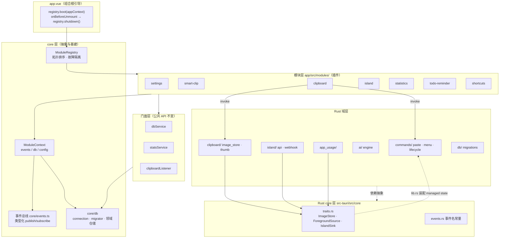
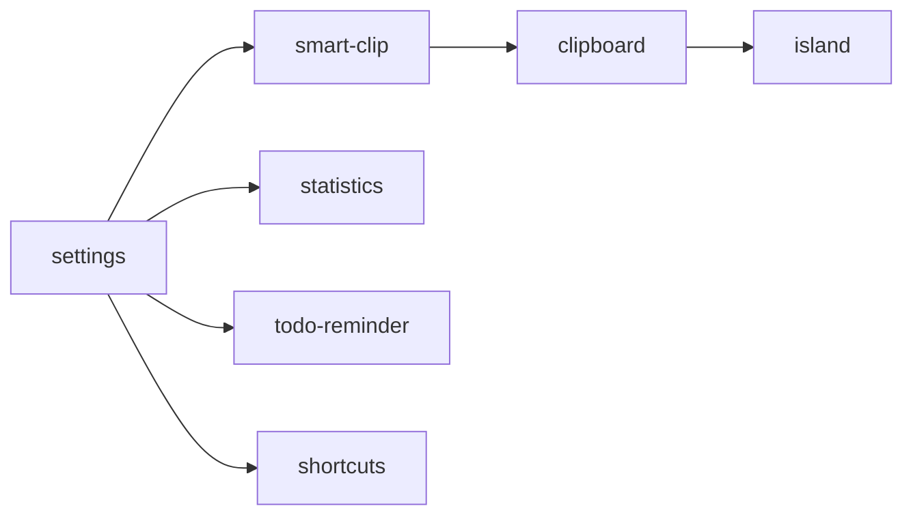

# S1d3 Board 模块化架构

> 模块化重构（0.4.0 之后）的架构文档：高内聚低耦合、依赖抽象、插件注册表式模块化，行为与既有版本完全一致。
> 配套文档：数据库设计（`database.md`）· 灵动岛 API（`island-api.md`）· 智能剪贴板 AI 分析（`smart-clip-ai-analysis.md`）

## 1. 重构目标与原则

| 原则 | 落地方式 |
|---|---|
| 依赖抽象而非实现 | 前端 `ModuleContext` 抽象（events/db/config 接口）+ Rust `traits.rs` 三 trait；模块只 import 接口，不 import 具体实现 |
| 模块解耦 | 模块间零直接引用：全部经 `core/events.ts` 类型化事件总线通信；故障经 registry 隔离（单模块 init/start 失败不影响其余模块） |
| 插件化架构 | 注册表式插件化：每个功能域一个 `AppModule`，经 `ModuleRegistry.register()` 注册，boot/shutdown 统一编排（Tauri `invoke_handler` 为编译期注册，不做运行时热插拔） |
| 统一注册/发现/管理 | `ModuleRegistry`：拓扑排序启动、反向序收尾、故障隔离；`ModuleContext` 为模块提供标准能力（事件/数据库/配置） |
| 边界与访问控制 | 分层约束（UI → 门面 → core）+ Rust 侧 `pub(crate)` 收敛 + 命令经 State 注入 trait，前端 invoke 签名不变 |
| 行为不变 | 门面层保留原公共 API；启动依赖序固化原 app.vue 硬约束；唯一语义微调见 §7 |

## 2. 总体架构



## 3. 前端：core 层

| 文件 | 职责 |
|---|---|
| `core/events.ts` | 类型化事件总线：`publish/subscribe`，事件名与载荷类型集中定义；模块间通信唯一通道 |
| `core/registry.ts` | `ModuleRegistry`：`register(AppModule)` + `boot(ctx)`（拓扑序 init → start）+ `shutdown()`（反拓扑序 stop → dispose）；init 可选；单模块故障被捕获隔离 |
| `core/context.ts` | `ModuleContext`：`createModuleContext({ events, db, config })`——模块可访问的标准能力接口 |
| `core/db/connection.ts` | 数据库连接层：`Database.load` + WAL/busy_timeout PRAGMA + `quick_check` 自检 + `execWithRetry`（locked 错误指数退避重试 3 次） |
| `core/db/migrator.ts` | 迁移链平移 + `ensureFeatureColumns` 幂等补列 |
| `core/db/appConnection.ts` | 应用主连接单例（每 webview 一个连接池，沿用插件语义） |
| `core/db/repositories/` | 9 个领域仓储：clipboard / pinnedClip / todo / note / stats / appIcon / backup / settings(KV) / islandHistory；SQL 全部参数化 |
| `core/db/imageRef.ts` · `sql.ts` | `imgfile:` 引用解析工具 · SQL 工具 |

## 4. 前端：模块层（AppModule）

模块为普通对象 `{ id, dependencies?, init?, start?, stop?, dispose? }`，经 `modules/index.ts` 组合根注册。

| 模块 id | 依赖 | 职责 |
|---|---|---|
| `settings` | —（锚点） | 配置锚点，无运行期资源；依赖声明根 |
| `smart-clip` | — | `initSmartClipListener()`：智能剪贴板规则加载与复制预判 |
| `clipboard` | smart-clip | `startClipboardListener()`（含数据库迁移）；stop 反注册监听 |
| `island` | clipboard | 灵动岛管理器 / API 桥 / 历史桥 / Webhook 恢复 |
| `statistics` | settings | 使用统计追踪启停（`startUsageTracking` / `stopUsageTracking`） |
| `todo-reminder` | settings | 待办提醒服务启动 |
| `shortcuts` | settings | 全局快捷键注册 / 反注册（失败仅降级） |

**启动顺序**（拓扑序，固化原 app.vue 硬约束：smart-clip 先于 clipboard）：



boot：`smart-clip.init → clipboard.start → island.start → statistics.start → todo-reminder.start → shortcuts.start`
shutdown：反拓扑序 stop，逐模块 try/catch 收尾（单模块 stop 失败不影响其余模块）。

## 5. 前端：门面与监听管道

| 文件 | 说明 |
|---|---|
| `db/dbService.ts` | 对外门面：公共方法签名与语义不变，内部委托领域仓储；`startClipboardListener` / `suppressUseCountBump` 转发至 `clipboardListener` |
| `clipboard/clipboardListener.ts` | 剪贴板监听管道（自 dbService 平移）：仓储单例装配 + `onTextUpdate/onSomethingUpdate` 管道 + `startListening`；`suppressUseCountBump` 抑制窗口存活于仓储闭包，门面转发与监听管道命中同一实例（防双计） |
| `statsService` | 统计埋点：连接切换至 `core/db/connection.ts`，公共 API 不变 |

## 6. Rust 侧

目录分域（对齐前端 core/ + 域目录 + 装配根）：

```
src-tauri/src/
├── lib.rs              # 装配根：插件注册 / traits 实现注入 / 命令清单
├── core/               # 抽象与基建（对齐前端 core/）
│   ├── events.rs       # 事件名常量（7 个 Tauri 事件）
│   └── traits.rs       # ImageStore / ForegroundSource / IslandSink + Handle 包装
├── clipboard/          # 剪贴板域：image_store.rs（图片文件存储）· thumb.rs（缩略图+QR）
├── island/             # 灵动岛域：api.rs（HTTP API+出站桥）· webhook.rs（Webhook 推送）
├── ai/                 # AI 域：engine.rs（多提供商引擎）
├── app_usage/          # 应用使用统计域（平台子模块）
├── commands/           # 命令域：paste.rs · menu.rs · lifecycle.rs
└── db/                 # 数据库域：migrations.rs（迁移链）
```

| 文件 | 说明 |
|---|---|
| `core/traits.rs` | 三抽象：`ImageStore`（图片文件存取）/ `ForegroundSource`（前台应用查询）/ `IslandSink`（岛事件出站）；`ImageStoreHandle`/`ForegroundSourceHandle` 为 managed state 包装（State 不进 invoke 载荷，前端签名不变） |
| `core/events.rs` | 事件名常量集中：`island:paste-detected` / `island:cut-detected` / `island:show` / `island-api:show` / `island-api:failed` / `island-history:query` / `ai:chunk` |
| `commands/` | 粘贴模拟与全局粘贴/剪切感知、Windows 原生菜单主题、应用退出；命令注册路径为完整子模块路径（`commands::paste::paste` 等），invoke 命令名不变 |
| `clipboard/image_store.rs` | 核心读写删抽为目录级函数 + `FsImageStore` 实现 `ImageStore`；三命令改 State 注入委托 |
| `clipboard/thumb.rs` | 剪贴板缩略图（CF_DIB 直出）与二维码识别（多尺度扫描）；`lib.rs` 顶层 `pub use` 供集成测试访问 |
| `app_usage/mod.rs` | `PlatformForegroundSource` 实现 `ForegroundSource`；`foreground_app_name` 命令 State 注入 |
| `island/api.rs` | `OutboundIslandSink` 实现 `IslandSink`（SSE 广播 + Webhook 投递）；出站桥闭包捕获 `Arc<dyn IslandSink>` |
| `lib.rs` | 装配根：`app.manage(ImageStoreHandle/ForegroundSourceHandle)`；generate_handler 命令清单不变（16 命令） |

## 7. 行为不变性说明

- **门面兼容**：`dbService` / `statsService` 公共 API 与语义不变，调用方零改动。
- **invoke 签名不变**：Rust State 注入不进载荷；命令名与参数全量保留。
- **启动硬约束**：smart-clip 先于 clipboard（复制预判先就位）；statistics/todo-reminder/shortcuts 为独立子系统，相对顺序调整无行为影响。
- **onCloseRequested 不 shutdown**：主窗口关闭仅隐藏到托盘，模块须保持运行（监听、提醒、快捷键不失效）——此为对「关窗即收尾」的有意例外，行为与重构前一致。
- **已知语义微调**（重构期间已交付的功能变更，非重构引入）：`max_save_count` 缺省按 1000 条裁剪、收藏项豁免淘汰；岛事件开关只关显示不拦截出站。

## 8. 测试体系

| 层 | 框架 | 数量 | 覆盖 |
|---|---|---|---|
| 前端单测 | vitest + happy-dom | 108 | 事件总线 / registry 拓扑与故障隔离 / 连接层 execWithRetry / 9 领域仓储 / 迁移平移 / 门面委托 / 模块启动顺序与隔离 |
| Rust 单测 | `cargo test` | 42 + 9 | image_store（消毒/穿越/回环/去重/超限）、clipboard_thumb（qrcode dev-dep QR 回环 + CF_DIB 解析）、migrations（迁移链文本不变式）、island_webhook（URL 白名单）、app_usage、ai（base_url 规整） |
| 类型检查 | `nuxi typecheck` | — | 无新增错误（存量基线 5 处与重构无关） |

## 9. 关键设计约束

1. 新增功能模块 = 新建 `xxx.module.ts` + `modules/index.ts` 注册 + 声明依赖，不改其余模块。
2. 模块间禁止直接 import 对方内部实现；跨模块通知一律走事件总线。
3. 新增高频数据库写点必须走 `execWithRetry`；SQL 全参数化。
4. Rust 事件名一律引用 `events.rs` 常量，禁止字面量散落。
5. 迁移链只追加不改写；`migrations.rs` 单测的迁移数断言需随新增迁移同步更新。
