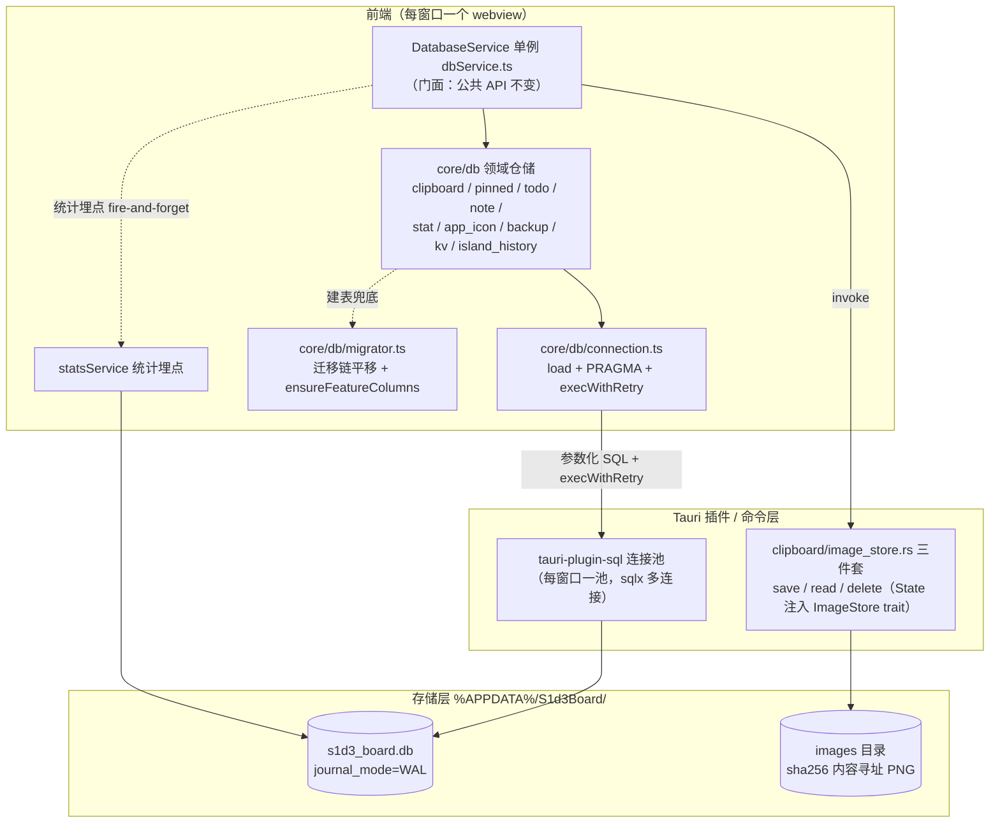
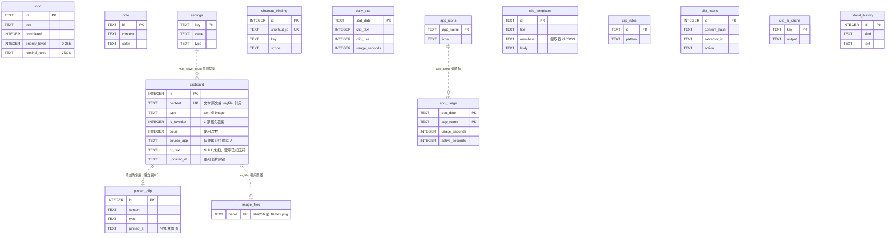
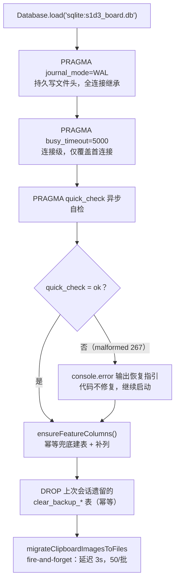
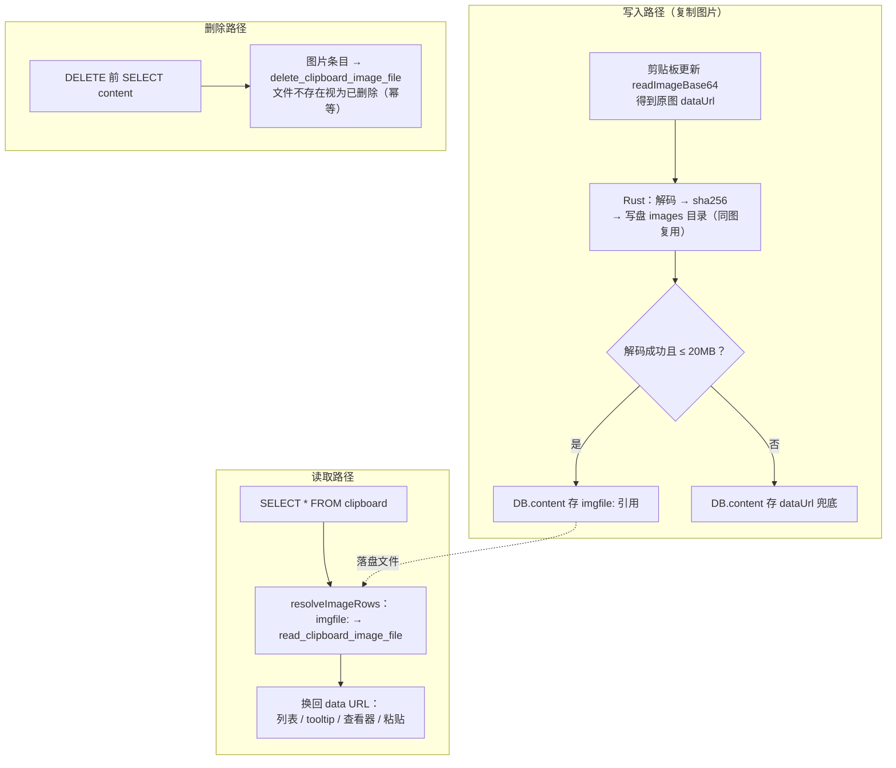
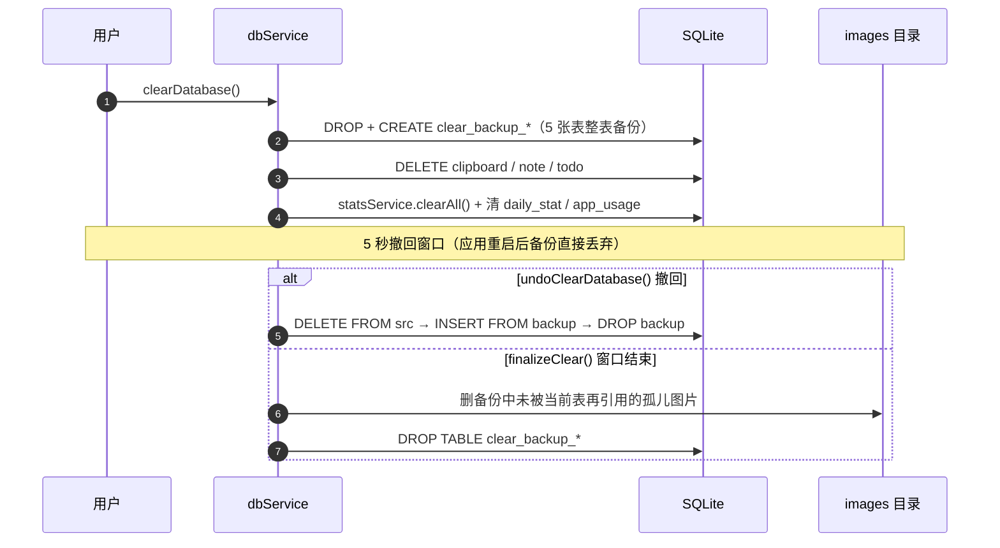

# S1d3 Board 数据库设计

> SQLite · 数据库文件 `s1d3_board.db` · 本文档与实现严格同步，以代码为准
> 迁移定义：`src-tauri/src/db/migrations.rs` · 服务层：`app/src/db/dbService.ts`（门面）· 仓储层：`app/src/core/db/`（连接 / 迁移 / 领域仓储）· 图片落盘：`src-tauri/src/clipboard/image_store.rs`

## 1. 总览

| 约定 | 说明 |
|---|---|
| 引擎 | SQLite（`tauri-plugin-sql`，启用 sqlite 后端） |
| 连接方式 | `Database.load('sqlite:s1d3_board.db')`；文件位于 `%APPDATA%/S1d3Board/s1d3_board.db` |
| 连接池 | 每窗口一个连接池（`tauri-plugin-sql` wrapper.rs `Pool::connect`，sqlx 默认多连接） |
| 日志模式 | `PRAGMA journal_mode=WAL`（持久写入文件头，全连接继承） |
| 写锁等待 | `PRAGMA busy_timeout=5000`（连接级，仅覆盖首连接）+ 应用层 `execWithRetry` 指数退避兜底 |
| 完整性自检 | 启动时 `PRAGMA quick_check`，损坏（267 malformed）仅日志指引恢复（代码无法修复） |
| 迁移机制 | `tauri_plugin_sql::Migration` 增量版本，新迁移追加到 vec 末尾，不得修改已发布条目 |
| 兜底列补齐 | 前端 `ensureFeatureColumns` 按 `PRAGMA table_info` 幂等补齐列（与 Rust 侧 migration 同 DDL 互不冲突） |
| 图片存储 | 原图不进 SQLite——落盘 `%APPDATA%/S1d3Board/images/`，DB 只存 `imgfile:<sha256前16hex>.png` 引用 |
| 字符编码 | UTF-8 |
| 时间戳 | 文本列 `created_at`/`updated_at` 存毫秒级 `Date.now()`；`CURRENT_TIMESTAMP` 默认值为秒级 ISO 文本 |

**整体架构**：



## 2. 表结构

**实体关系**（逻辑关联，SQLite 未建外键约束；`image_files` 为文件系统目录，非数据库表）：



### 2.1 剪贴板主表 `clipboard`

剪贴板历史记录（文本/图片）。

| 列 | 类型 | 约束 / 默认 | 说明 |
|---|---|---|---|
| `id` | INTEGER | PRIMARY KEY AUTOINCREMENT | 主键 |
| `content` | TEXT | NOT NULL UNIQUE | 内容；图片存 `imgfile:<名>.png` 引用，文本存原文 |
| `created_at` | TEXT | DEFAULT CURRENT_TIMESTAMP | 创建时间 |
| `source` | TEXT | | 来源（旧列，保留） |
| `is_favorite` | INTEGER | DEFAULT 0 CHECK IN (0,1) | 收藏标记，豁免裁剪 |
| `category` | TEXT | | 分类 |
| `count` | INTEGER | DEFAULT 1 | 使用次数 |
| `updated_at` | TEXT | DEFAULT CURRENT_TIMESTAMP | 更新时间（主列表排序键） |
| `type` | TEXT | DEFAULT 'text' CHECK IN ('text','image') | 内容类型（v3 新增） |
| `source_app` | TEXT | | 复制瞬间的前台进程名（仅 INSERT 时写入，冲突不覆盖） |
| `qr_text` | TEXT | | 图片二维码识别结果（NULL 未扫，'' 已扫无码，文本=识别成功） |

**索引**：`idx_timestamp (created_at DESC)`、`idx_source (source)`、`idx_favorite (is_favorite)`、`idx_clip_updated (updated_at DESC)`（v12）

**裁剪规则**：超出 `max_save_count`（默认 1000）时按 `updated_at ASC, id ASC` 淘汰最旧非收藏项；`is_favorite=1` 豁免；图片条目删除联动删原图文件。

### 2.2 常用剪贴 `pinned_clip`

快捷功能表——独立内容副本，可排序、可编辑，不限量存储。

| 列 | 类型 | 约束 / 默认 | 说明 |
|---|---|---|---|
| `id` | INTEGER | PRIMARY KEY AUTOINCREMENT | 主键 |
| `content` | TEXT | NOT NULL | 内容（图片存 base64，未走落盘改造） |
| `type` | TEXT | NOT NULL DEFAULT 'text' CHECK IN ('text','image') | 内容类型 |
| `name` | TEXT | | 显示名 |
| `sort_order` | INTEGER | NOT NULL DEFAULT 0 | 恒为 0（v13 已删其索引） |
| `created_at` | TEXT | DEFAULT CURRENT_TIMESTAMP | |
| `updated_at` | TEXT | DEFAULT CURRENT_TIMESTAMP | |
| `source` | TEXT | | 来源应用（v5 新增） |
| `pinned_at` | TEXT | | 置顶时间（v5 新增，空=未置顶） |

**排序规则**：置顶项优先（`pinned_at` 非空优先，按 `pinned_at DESC`），其余按 `created_at DESC, id DESC`。

### 2.3 待办 `todo`

| 列 | 类型 | 约束 / 默认 | 说明 |
|---|---|---|---|
| `id` | TEXT | PRIMARY KEY | 客户端生成 |
| `title` | TEXT | NOT NULL | 标题 |
| `description` | TEXT | | 描述 |
| `completed` | INTEGER | NOT NULL CHECK IN (0,1) | 完成状态 |
| `priority` | TEXT | CHECK IN ('low','medium','high') | 旧三档文本列（随 `priority_level` 同步） |
| `category` | TEXT | | 分类 |
| `created_at` | TEXT | DEFAULT CURRENT_TIMESTAMP | |
| `updated_at` | TEXT | | |
| `dueDate` | TEXT | | 到期时间（本地 ISO `YYYY-MM-DDTHH:mm`） |
| `remind_mode` | TEXT | | 提醒模式：`smart`/`off`/`custom`，NULL 视为 smart（v8） |
| `remind_at` | TEXT | | 自定义提醒时刻（v8） |
| `priority_level` | INTEGER | | 数值化优先级 0-255，越大越优先（v9；旧三档映射 0/127/255） |
| `remind_rules` | TEXT | | 自定义提醒闹钟 JSON 列表（v10）：`[{id,kind:'percent'|'offset'|'at',value}]` |

### 2.4 便签 `note`

| 列 | 类型 | 约束 / 默认 |
|---|---|---|
| `id` | TEXT | PRIMARY KEY |
| `content` | TEXT | NOT NULL |
| `color` | TEXT | |
| `created_at` | TEXT | DEFAULT CURRENT_TIMESTAMP |
| `updated_at` | TEXT | DEFAULT CURRENT_TIMESTAMP |

### 2.5 通用配置 `settings`

KV 配置表。

| 列 | 类型 | 约束 / 默认 | 说明 |
|---|---|---|---|
| `id` | INTEGER | PRIMARY KEY | |
| `key` | TEXT | NOT NULL UNIQUE | 配置键 |
| `value` | TEXT | | 配置值 |
| `type` | TEXT | NOT NULL CHECK IN ('shortcut','general','other','ai_setting') | 分类 |
| `description` | TEXT | | |
| `scope` | TEXT | | |
| `create_at` | TEXT | DEFAULT CURRENT_TIMESTAMP | |
| `updated_at` | TEXT | DEFAULT CURRENT_TIMESTAMP | |

**预置键**：`max_save_count`（默认 500，运行时按 1000 兜底）、`color_scheme`（v14 纠正为 `'system'`）、`api_key`。

### 2.6 快捷键绑定 `shortcut_binding`

与 `settings` KV 解耦的规范化快捷键表（v2 新增）。

| 列 | 类型 | 约束 / 默认 |
|---|---|---|
| `id` | INTEGER | PRIMARY KEY AUTOINCREMENT |
| `shortcut_id` | TEXT | NOT NULL UNIQUE |
| `key` | TEXT | NOT NULL |
| `scope` | TEXT | NOT NULL CHECK IN ('global','local') |
| `description` | TEXT | |
| `created_at` | TEXT | DEFAULT CURRENT_TIMESTAMP |
| `updated_at` | TEXT | DEFAULT CURRENT_TIMESTAMP |

**索引**：`idx_shortcut_scope (scope)`

### 2.7 每日统计 `daily_stat`

永久使用统计——一行一天（本地时区 `YYYY-MM-DD`）。

| 列 | 类型 | 默认 | 说明 |
|---|---|---|---|
| `stat_date` | TEXT PRIMARY KEY | | 日期 |
| `clip_text` | INTEGER | 0 | 新增文本剪贴数 |
| `clip_image` | INTEGER | 0 | 新增图片剪贴数 |
| `clip_use` | INTEGER | 0 | 粘贴使用次数 |
| `clip_chars` | INTEGER | 0 | 复制字符总量 |
| `todo_added` | INTEGER | 0 | 待办新增数 |
| `todo_completed` | INTEGER | 0 | 待办完成数 |
| `todo_deleted` | INTEGER | 0 | 待办删除数 |
| `todo_chars` | INTEGER | 0 | 待办内容量（v7；标题+描述字符数） |
| `note_added` | INTEGER | 0 | 便签新增数 |
| `note_deleted` | INTEGER | 0 | 便签删除数 |
| `favorite_toggle` | INTEGER | 0 | 收藏切换次数 |
| `usage_seconds` | INTEGER | 0 | 当日窗口可见+聚焦时长（秒） |
| `shortcut_count` | INTEGER | 0 | 快捷键使用次数 |
| `tab_clip`/`tab_todo`/`tab_note`/`tab_pinned`/`tab_setting`/`tab_statistics` | INTEGER | 0 | 各 Tab 访问次数 |
| `active_dawn`/`active_day`/`active_evening`/`active_night` | INTEGER | 0 | 四时段操作次数（05-08/09-17/18-22/23-04） |
| `todo_reminded` | INTEGER | 0 | 提醒触发次数（v8） |
| `tab_app_usage` | INTEGER | 0 | 应用时长 Tab 访问次数（v15） |
| `ai_analysis` | INTEGER | 0 | AI 分析成功次数（兜底补齐） |
| `clip_cut` | INTEGER | 0 | 剪切成功次数（兜底补齐） |

### 2.8 桌面应用使用时长 `app_usage`

按天×应用累计前台窗口时长（v15）。

| 列 | 类型 | 约束 / 默认 | 说明 |
|---|---|---|---|
| `stat_date` | TEXT | NOT NULL | 日期 |
| `app_name` | TEXT | NOT NULL | 应用标识（进程名/应用名） |
| `usage_seconds` | INTEGER | NOT NULL DEFAULT 0 | 前台总时长（含挂机） |
| `active_seconds` | INTEGER | NOT NULL DEFAULT 0 | 活跃时长（键鼠无输入>5min 不计入） |
| | | PRIMARY KEY (stat_date, app_name) | |

### 2.9 应用图标缓存 `app_icons`

| 列 | 类型 | 约束 |
|---|---|---|
| `app_name` | TEXT | PRIMARY KEY |
| `icon` | TEXT | NOT NULL（PNG data URL） |

### 2.10 智能剪贴方案 `clip_templates`

多提取器集成的方案表（v17；原 `clip_rules` 分词规则表已废弃，表与旧数据保留但不再读写）。

| 列 | 类型 | 约束 / 默认 | 说明 |
|---|---|---|---|
| `id` | TEXT | PRIMARY KEY | |
| `name` | TEXT | NOT NULL | 旧列，与 `title` 同步写入兼容旧二进制 |
| `body` | TEXT | NOT NULL | 模板体（支持占位符） |
| `enabled` | INTEGER | NOT NULL DEFAULT 1 CHECK IN (0,1) | |
| `created_at` | TEXT | DEFAULT CURRENT_TIMESTAMP | |
| `updated_at` | TEXT | DEFAULT CURRENT_TIMESTAMP | |
| `title` | TEXT | | 方案标题（兜底补齐；旧数据以 `name` 兜底） |
| `description` | TEXT | | 方案描述（兜底补齐） |
| `members` | TEXT | | 成员提取器 id 列表 JSON（兜底补齐；空/脏数据=空数组=接入全部提取器） |

### 2.11 智能剪贴规则 `clip_rules`（已废弃）

> 用户侧只维护提取器与方案，拆分能力由提取器的正则/分隔符承担。表与旧数据保留但不再读写。

| 列 | 类型 | 约束 |
|---|---|---|
| `id` | TEXT | PRIMARY KEY |
| `name` | TEXT | NOT NULL |
| `type` | TEXT | NOT NULL CHECK IN ('separator','regex') |
| `pattern` | TEXT | NOT NULL |
| `priority` | INTEGER | NOT NULL DEFAULT 0 |
| `enabled` | INTEGER | NOT NULL DEFAULT 1 CHECK IN (0,1) |
| `created_at` | TEXT | DEFAULT CURRENT_TIMESTAMP |
| `updated_at` | TEXT | DEFAULT CURRENT_TIMESTAMP |

### 2.12 用户习惯记录 `clip_habits`（兜底建表）

环形气泡选择/粘贴行为记录，FIFO 保留最近 500 条。

| 列 | 类型 | 约束 / 默认 |
|---|---|---|
| `id` | INTEGER PRIMARY KEY AUTOINCREMENT | |
| `content_hash` | TEXT | NOT NULL |
| `extractor_id` | TEXT | NOT NULL DEFAULT '' |
| `action` | TEXT | NOT NULL（`paste`/`pin`） |
| `segment_text` | TEXT | NOT NULL DEFAULT '' |
| `created_at` | INTEGER | NOT NULL |

### 2.13 AI 结果冷却缓存 `clip_ai_cache`（兜底建表）

| 列 | 类型 | 约束 |
|---|---|---|
| `key` | TEXT | PRIMARY KEY |
| `output` | TEXT | NOT NULL |
| `created_at` | INTEGER | NOT NULL |

### 2.14 灵动岛历史 `island_history`（兜底建表）

全部弹岛来源（复制/粘贴/AI/设置操作/第三方 API）汇聚写入，FIFO 保留最近 500 条。

| 列 | 类型 | 约束 / 默认 |
|---|---|---|
| `id` | INTEGER PRIMARY KEY AUTOINCREMENT | |
| `kind` | TEXT | NOT NULL |
| `text` | TEXT | NOT NULL DEFAULT '' |
| `created_at` | INTEGER | NOT NULL |

## 3. 全文索引（已废弃）

`clipboard_fts`（FTS5）与三个同步触发器在 v1 创建，v3 重构为仅文本同步，v11 整体删除——前端搜索走 `LIKE`，FTS 纯属写开销。`clipboard_fts` 表与 `clipboard_after_insert/update/delete` 触发器均已不存在。

## 4. 迁移版本历史

| 版本 | 描述 |
|---|---|
| 1 | 建 `clipboard`/`clipboard_fts`/`todo`/`note`/`settings`、索引、FTS 触发器；播种 `max_save_count`/`color_scheme`/`api_key` |
| 2 | 删孤儿 `shortcut_setting`，建规范化 `shortcut_binding` |
| 3 | `clipboard` 加 `type` 列，FTS 触发器重构为仅文本同步 |
| 4 | 建 `pinned_clip` 常用剪贴表 |
| 5 | `pinned_clip` 加 `source`/`pinned_at` 列 |
| 6 | 建 `daily_stat` 永久统计表 |
| 7 | `daily_stat` 加 `todo_chars` 列 |
| 8 | `todo` 加 `remind_mode`/`remind_at`，`daily_stat` 加 `todo_reminded` |
| 9 | `todo` 加 `priority_level`（0-255），旧三档文本迁移 |
| 10 | `todo` 加 `remind_rules` JSON 列 |
| 11 | 删除未使用的 FTS 索引表与触发器 |
| 12 | 加 `idx_clip_updated` 索引（主列表按 `updated_at` 排序） |
| 13 | 删未使用的 `idx_pinned_sort` 索引 |
| 14 | 纠正 `color_scheme` 种子默认值为 `'system'` |
| 15 | 建 `app_usage` 表，`daily_stat` 加 `tab_app_usage` 列 |
| 16 | 建 `app_icons` 图标缓存表 |
| 17 | 建 `clip_rules`/`clip_templates` 智能剪贴表 |

## 5. 初始化流程

`DatabaseService.initDatabase()`（单例）：

1. `Database.load('sqlite:s1d3_board.db')` 建立连接
2. `PRAGMA journal_mode=WAL` —— 持久写文件头，全连接继承
3. `PRAGMA busy_timeout=5000` —— 连接级，仅覆盖首连接
4. `PRAGMA quick_check` 异步自检 —— 损坏仅日志指引恢复
5. `ensureFeatureColumns()` —— 幂等补齐兜底建表与列（防旧二进制迁移未执行）
6. 清理上次会话遗留的 `clear_backup_*` 表（撤回窗口随进程结束已失效）
7. `migrateClipboardImagesToFiles()` fire-and-forget —— 延迟 3s，分批 50/批，旧 base64 条目落盘换 `imgfile:` 引用



## 6. 图片落盘机制

**设计理念**：原图不进 SQLite——base64 直接落库有 ~33% 体积膨胀，且 `SELECT *` 全量拉取时把所有原图读进内存拖垮列表查询。参考 CopyQ/Ditto/PasteBar/Gwen 的共识做法：图片存文件系统，DB 只存引用。

| 项 | 说明 |
|---|---|
| 落盘目录 | `%APPDATA%/S1d3Board/images/<sha256 前 16 hex>.png` |
| 内容寻址 | sha256 命名天然去重——重复复制同一张图只占一份磁盘 |
| DB 引用 | `content` 列存 `imgfile:<文件名>` |
| 单条上限 | `MAX_IMAGE_BYTES = 20MB`（超限拒存，条目仍建，粘贴回落系统剪贴板现内容） |
| 文件名消毒 | 只允许纯文件名，拒绝任何路径成分（防 `../`、绝对路径穿越） |
| 路径双保险 | 文件名已消毒，再确认父目录确为 `images` 目录（防符号链接绕过） |

**Rust 命令三件套**（`src-tauri/src/clipboard/image_store.rs`）：

| 命令 | 语义 |
|---|---|
| `save_clipboard_image(data_url)` | 解码 → sha256 命名 → 写盘（已存在复用）→ 返回 `imgfile:<名>`；失败/超限返回 `None` |
| `read_clipboard_image_file(file)` | 读盘 → data URL；文件缺失/非法文件名返回 `None` |
| `delete_clipboard_image_file(file)` | 删文件；不存在视为已删除（幂等 `true`） |

**读取边界**：`resolveImageRows` 在 `fetchClipboardData`/`fetchClipboardSingleData` 返回前统一把 `imgfile:` 引用换回原图 data URL，下游列表/tooltip/查看器/粘贴零改动保原图质量。

**删除联动**：`deleteClipboardData` 删前取 `content`，图片条目调 `deleteImageFileByRef`；`trimClipboard` 先 SELECT 候选再分批（500/批）按 id 删，图片条目联动删文件；`clearDatabase` 阶段不删文件（5s 撤回窗口内 undo 后引用须有效），改在 `finalizeClear` 删备份中未被当前表再引用的孤儿。

**读写删三路径**：



## 7. 可靠性保障

### 7.1 WAL 模式

`PRAGMA journal_mode=WAL` 持久写入 DB 文件头，一次设置所有连接/窗口继承。读写不再互斥，显著缩短写锁等待——修复收藏/粘贴等高频写操作报 "database is locked"(517) 与并发冲突。

### 7.2 busy_timeout

`PRAGMA busy_timeout=5000` 为连接级非持久——本连接的写操作遇短时锁竞争时由 SQLite 内部等待重试而非立即报错；池内其他按需新建的连接不继承，由 `execWithRetry` 兜底。

### 7.3 execWithRetry

应用层对 "database is locked"(517) 指数退避重试 3 次（80/160/320ms）。

- **仅锁错误重试**：损坏(267 malformed)/语法等错误立即抛出，不掩盖真问题
- **应用范围**：`saveClipboard`/`updateFavorite`/`increaseUseCount`/`insertIslandHistory` 等高频写点
- **新增高频写方法应同样走 `execWithRetry`**

### 7.4 完整性自检

启动 `PRAGMA quick_check` 轻量自检。文件损坏（malformed, 267）无法由代码凭空修复，启动时显式暴露，日志给出恢复指引：

```
[db] 数据库完整性检查失败: <result>。文件已损坏，请关闭应用后备份
%APPDATA%/S1d3Board/s1d3_board.db，并用 sqlite3 ".recover" 或 DB Browser for SQLite 导出重建。
```

## 8. 清空撤回机制

`clearDatabase` 清空前把业务/统计表整表复制到 `clear_backup_*`，5 秒撤回窗口内可整表恢复，窗口结束或应用重启后丢弃。

**备份表映射**（`CLEAR_BACKUP_TABLES`）：

| 源表 | 备份表 |
|---|---|
| `clipboard` | `clear_backup_clipboard` |
| `note` | `clear_backup_note` |
| `todo` | `clear_backup_todo` |
| `daily_stat` | `clear_backup_daily_stat` |
| `app_usage` | `clear_backup_app_usage` |

- `clearDatabase`：保留 `settings`/`shortcut_binding`/`pinned_clip`，重置自增主键
- `undoClearDatabase`：整表还原，返回是否有备份被恢复
- `finalizeClear`：丢弃备份；清理被清空图片条目的原图文件（只删当前 `clipboard` 表未再引用的文件，防 undo 后重新复制的同图被误删）
- 上次会话遗留的备份在 `initDatabase` 中清理

**清空与撤回时序**：



## 9. 数据库服务方法清单

`DatabaseService` 单例（`app/src/db/dbService.ts`）为对外门面：模块化重构后各方法委托
`app/src/core/db/repositories/` 领域仓储执行（公共 API 与语义不变），按业务分组：

### 9.1 剪贴板

| 方法 | 说明 |
|---|---|
| `startClipboardListener()` | 启动剪贴板监听（text+image），文本/图片更新回调写入并派发岛事件 |
| `saveClipboard(content, type, sourceApp?, qrText?, islandImageContent?)` | upsert 写入；`ON CONFLICT(content)` 不递增 count；仅新插入时统计埋点+裁剪+智能剪贴广播 |
| `fetchClipboardData(filter, page?)` | 列表查询（收藏/类型/搜索过滤 + 分页）；图片引用统一解析回 data URL |
| `fetchClipboardSingleData(id)` | 单条查询 |
| `updateFavorite(id, value)` | 切换收藏 + 统计 |
| `increaseUseCount(id)` | 按 id 递增使用次数 + 统计 |
| `increaseUseCountByContent(content)` | 按内容精确匹配复用 `increaseUseCount`（全局 Ctrl+V 感知） |
| `deleteClipboardData(id)` | 删条目 + 图片联动删文件 |
| `trimClipboard()` | 按 `max_save_count` 裁剪最旧非收藏项 |
| `decodeQrText(id, content)` | 惰性补识别二维码（NULL/'' 可写，已有结果不覆盖） |
| `resolveImageContent(content)` | `imgfile:` 引用 → data URL（私有） |
| `migrateClipboardImagesToFiles()` | 存量图片迁移（私有，fire-and-forget） |

### 9.2 常用剪贴

| 方法 | 说明 |
|---|---|
| `fetchPinnedClips(page?)` | 列表（置顶优先，其余按时间倒序） |
| `fetchPinnedClip(id)` | 单条 |
| `insertPinnedClip(content, type, name?, source?)` | 新增（最新排最前，不限量） |
| `isPinnedContentExist(content, type)` | 去重判定 |
| `updatePinnedClip(id, content, name, type)` | 更新 |
| `pinPinnedClip(id, pinned)` | 置顶/取消 |
| `deletePinnedClip(id)` | 删除（不影响主列表原条目） |

### 9.3 待办 / 便签

| 方法 | 说明 |
|---|---|
| `insertTodo`/`updateTodo`/`deleteTodo`/`fetchTodos`/`fetchSingleTodo` | 待办 CRUD；`priority_level` 收敛 0-255，旧三档文本同步；`remind_rules` JSON 序列化/解析 |
| `insertNote`/`updateNote`/`deleteNote`/`fetchNotes`/`fetchSingleNote` | 便签 CRUD |

### 9.4 配置 / 快捷键

| 方法 | 说明 |
|---|---|
| `setKeyValue(key, value)` | UPSERT 配置（`ON CONFLICT(key)`） |
| `getKeyValue(key)` | 读配置 |
| `saveShortcutSetting(id, value, scope, title)` | 快捷键 upsert（按 `shortcut_id`） |
| `loadShortcutSettings()` | 加载已保存快捷键 |

### 9.5 智能剪贴方案

| 方法 | 说明 |
|---|---|
| `fetchClipSchemes()` | 全量方案（按 `updated_at` 倒序） |
| `saveClipScheme(scheme)` | UPSERT 单条（`name` 与 `title` 同步） |
| `deleteClipScheme(id)` | 删除 |

### 9.6 习惯 / 缓存 / 历史

| 方法 | 说明 |
|---|---|
| `insertClipHabit(h)` | 记录强信号动作（`paste`/`pin`），保留最近 500 条 |
| `fetchHabitDigest()` | 偏好摘要：最近 100 次 paste 中各提取器产出被粘贴次数 Top5 |
| `getAiCache(key, windowSec)` | 读 AI 缓存（过期/不存在返回 `null`） |
| `setAiCache(key, output)` | 写/刷新 AI 缓存 |
| `insertIslandHistory(h)` | 灵动岛历史写入（FIFO 500 条） |
| `getIslandHistory(limit?, filter?)` | 历史查询（kind/from/to 过滤） |
| `clearIslandHistory()` | 清空历史 |

### 9.7 清空撤回

| 方法 | 说明 |
|---|---|
| `clearDatabase()` | 清空业务+统计数据，保留配置/常用剪贴，重置自增主键，备份到 `clear_backup_*` |
| `undoClearDatabase()` | 撤回清空（整表还原），返回是否有备份被恢复 |
| `finalizeClear()` | 撤回窗口结束丢弃备份 + 清理孤儿图片文件 |

## 10. 关键设计约束

- **图片原图永不进 SQLite**：DB 只存 `imgfile:` 引用，读取边界统一解析；岛事件派发必须传原图 dataUrl（引用串对岛回退渲染/出站推送/历史缩略图无意义）
- **`source_app`/`qr_text` 仅 INSERT 时写入**：应用自身粘贴也会写剪贴板，冲突时若更新会覆盖历史条目的原始来源/识别结果——`ON CONFLICT` 不更新这两列
- **裁剪豁免收藏**：`is_favorite=1` 永不被 `max_save_count` 上限挤掉；收藏占比高时可能删完 excess 后仍超上限，下次插入继续淘汰
- **`max_save_count` 默认 1000**：未设置/空/0/负数/非数字时按 1000 裁剪（0 无「存 0 条」实际意义，视为未配置）
- **WAL + busy_timeout + execWithRetry 三件套**：分别覆盖持久/连接级/应用层三个粒度的写锁竞争
- **迁移只追加不修改**：新迁移追加到 `migrations()` vec 末尾（版本号递增），已发布条目不得修改
- **兜底列补齐幂等**：`ensureFeatureColumns` 按 `PRAGMA table_info` 检查后补齐，与 Rust 侧 migration 同 DDL 互不冲突
