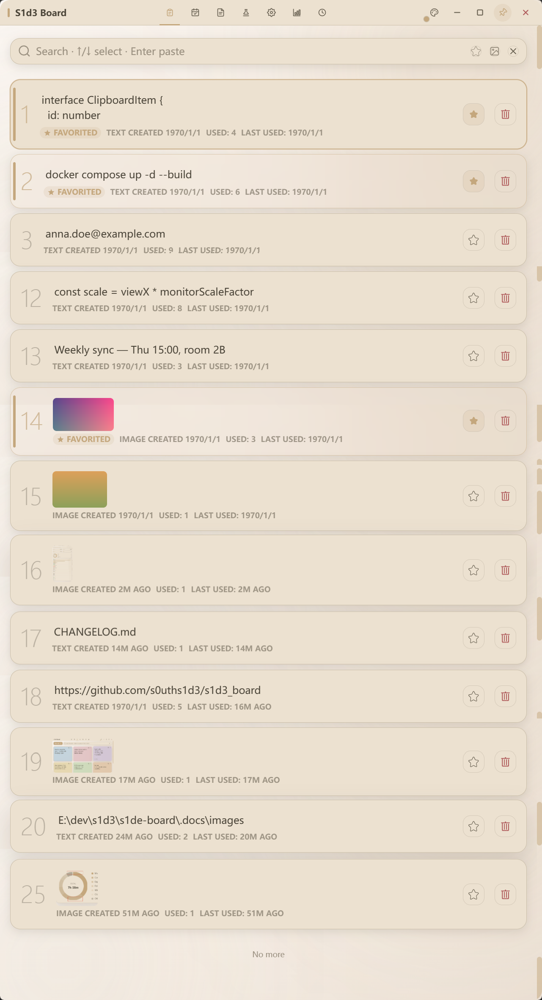
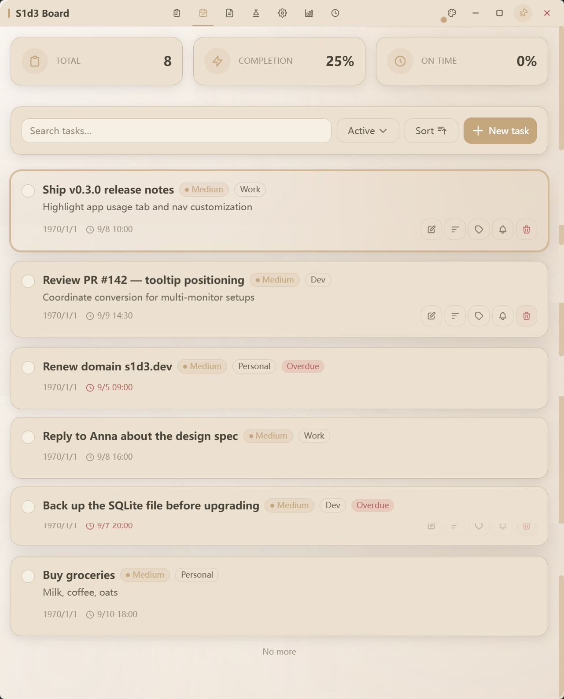
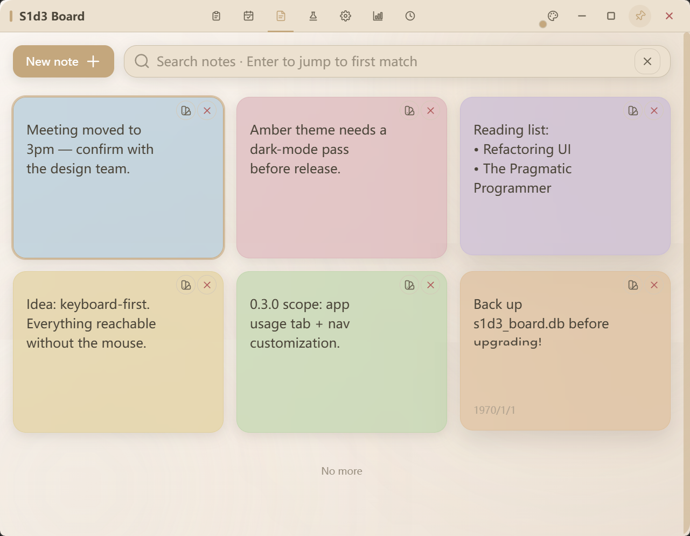
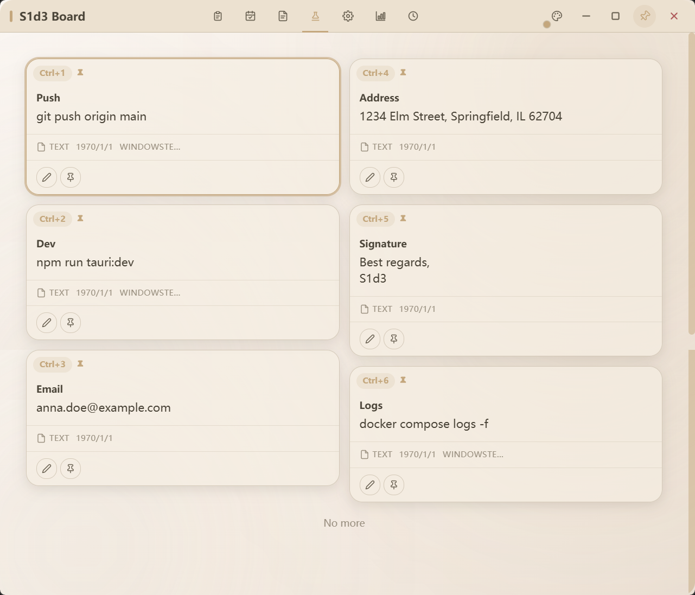
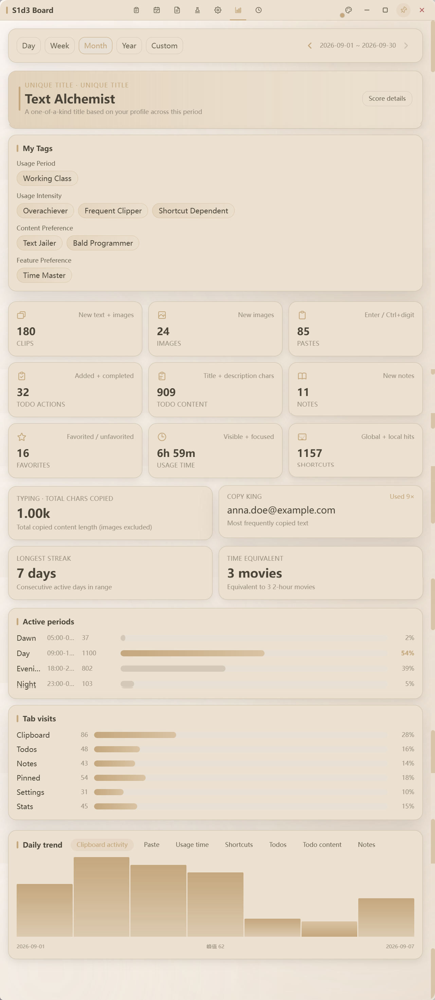
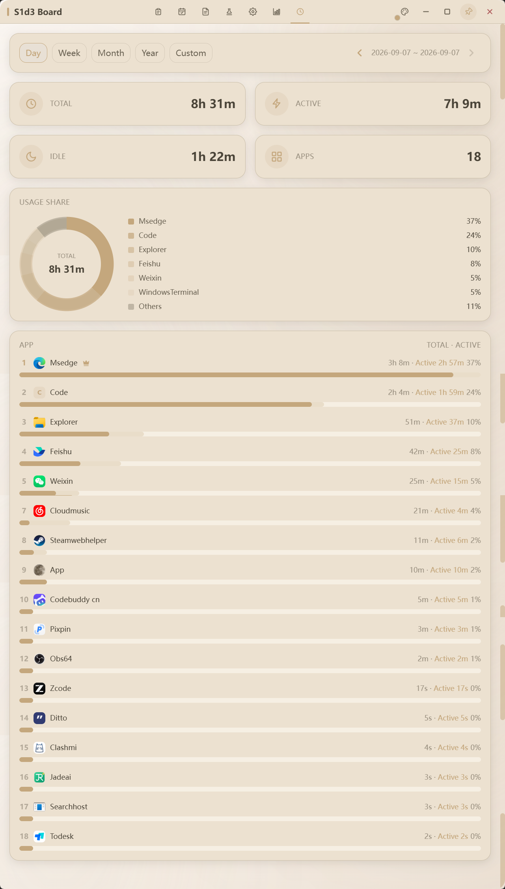

<div align="center">

# S1d3 Board

**一个常驻系统托盘的效率面板，把剪贴板、待办、便签与统计收进一次快捷键的距离**

[English](./README.md) · [简体中文](./README.zh-CN.md)

<br/>


</div>

## 🤔 为什么做 S1d3 Board

日常里最高频的操作，往往也是最琐碎、最容易被工具"过度对待"的那几件：

- **系统剪贴板很难用**：它只关心「上一次复制」——新内容直接覆盖旧内容、重启后即清空，既不能搜索也没有收藏；开启云同步后，复制过的内容还会被同步到其他设备
- **工具越装越多，切换成本越高**：剪贴板历史、待办、便签各占一个应用，各自一套窗口、一套快捷键、一套数据格式
- **重型工具太重**：只是想随手记一笔、粘一段，却要等一个完整应用启动、占据一块屏幕
- **这些记录不该离开本机**：复制过的内容、待办、便签都是高度个人化的数据，放在本地比交给云端更让人安心
- **常驻工具不该拖慢电脑**：既然要整天挂在后台，性能与内存就得克制——后端用 Rust 实现，换取更好的性能与更低的内存占用

S1d3 Board 想做的不是"再来一个效率应用"，而是把这些高频琐事收进**一个随叫随到的面板**：`Ctrl+I` 呼之即来，`Esc` 挥之即去，用完就退场，不打断手上的活。

## 💡 S1d3 Board 是什么

一个**常驻系统托盘的桌面效率面板**。

它不是一个需要长期开在屏幕上的窗口，而是平时藏在托盘里、需要时由全局快捷键唤出的轻量面板：

- **托盘常驻 + 全局快捷键**：`Ctrl+I` 任意时刻唤出，失焦自动隐藏，单实例运行（重复启动只会聚焦已有窗口）
- **无边框 / 透明窗口**：贴近原生面板的观感，不抢视觉焦点
- **本地优先**：数据全部存放在本机 SQLite，无需账号、不依赖云端
- **按需裁剪**：标签页可自由排序与启停，只留下自己真正用得到的模块

## 🖼️ 界面预览

| 剪贴板 | 待办 |
|:---:|:---:|
|  |  |
| **便签** | **常用剪贴板** |
|  |  |
| **统计** | **应用时长** |
|  |  |

## 🎯 核心功能

| 模块 | 解决什么 | 关键能力 |
|---|---|---|
| 📋 **剪贴板** | 复制过的内容找不回来 | 自动记录文本与图片、全文搜索、收藏、一键粘贴、图片查看器 |
| 📌 **常用剪贴板** | 高频内容每次都要重新找 | 置顶固定常用项，`Ctrl+1 ~ Ctrl+0` 直达粘贴 |
| ✅ **待办** | 临时事项记在脑子里 | 优先级、分类、截止日期、智能/自定义重复提醒 |
| 🗒️ **便签** | 零散想法无处安放 | 多色瀑布流便签，`Ctrl+N` 新建、`Ctrl+Enter` 保存 |
| 📊 **统计** | 不知道时间花在哪 | 多维使用数据、时间范围切换、趣味数据与用户画像标签 |
| ⏱️ **应用时长** | 桌面时间被谁吃掉 | 按应用聚合前台时长，活跃/挂机拆分，占比环形图（默认关闭） |
| 🏝️ **灵动岛** | 操作反馈散落在各处 | 屏幕顶部胶囊提示：复制/粘贴/剪切感知、任务与提醒反馈、历史窗口、开放 API 与 Webhook |
| 🧠 **智能剪贴板** | 复制内容值得被加工 | 提取器分词与方案重组、AI 分析（关键词/总结/习惯画像）、环形气泡窗、灵动岛联动 |
| ⚙️ **设置** | 工具应该适配人 | 快捷键录制与冲突检测、配色、语言、窗口弹出位置、导航配置 |

贯穿所有模块的能力：**全局快捷键系统**（全部可自定义）、**中英双语**（可跟随系统）、**灵动岛反馈**（各窗口操作提示统一弹岛）、**多窗口协作**（悬停提示 / 图片查看器 / 删除确认）、**流式加载**（数据量大不卡顿）。

以下按模块展开关键能力。

### 📋 剪贴板（clip）
- **自动记录**：复制的文本与图片自动入库，超出上限自动淘汰最旧记录
- **全文搜索**：关键词过滤 + 匹配文本金色高亮
- **收藏夹**：`Ctrl+L` 一键收藏/取消收藏
- **一键粘贴**：`Enter` 粘贴选中项，`Ctrl+Shift+1 ~ Ctrl+Shift+0` 全局粘贴前 10 项
- **独立查看窗口**：悬停提示展示完整内容（保留原始缩进），图片查看器支持缩放 / 旋转 / 多图切换

### 📌 常用剪贴板（pinned）
- 将常用内容**置顶固定**为可快速粘贴的常用项，瀑布流布局
- `Ctrl+U` 添加选中项，`Ctrl+1 ~ Ctrl+0` 直接粘贴前 10 项
- **方向键导航**：`↑↓←→` 几何最近邻选中，`Delete` 删除（内联确认框）

### ✅ 待办（todo）
- 创建/编辑/删除，支持优先级（低/中/高）与分类
- **截止日期**：统一暖色主题日期时间选择器
- **重复提醒**：智能/自定义闹钟规则，到期提醒

### 🗒️ 便签（note）
- 多色便签（蓝/黄/粉/绿/紫/橙），瀑布流布局
- **双击 / Ctrl+Enter** 进入编辑，`Ctrl+Enter` 保存，`Ctrl+N` 新建
- 删除带内联确认框 + 即时 toast 反馈

### 📊 统计（statistics）
- **多维使用数据**：剪贴 / 图片 / 粘贴 / 剪切 / AI 分析 / 待办 / 便签 / 收藏 / 使用时长 / 快捷键 / Tab 访问
- **时间范围**：`RangeBar` 统一范围栏（日/周/月/年/自定义），与应用时长页共用
- **趋势与分布**：核心指标卡片、Tab 访问分布、活跃时段、每日趋势图
- **趣味数据**：打字量、复制之王、最长连续使用、时长换算
- **用户画像**：实时生成使用习惯标签 + 专属称号与评分明细

### ⏱️ 应用时长（app_usage）
- **前台时长采集**：Rust 侧监听前台窗口，30 秒分段结算，按应用聚合
- **汇总与排行**：总 / 活跃 / 挂机三卡 + 时长降序排行（含应用图标）与占比环形图
- **范围切换**：与统计页共用 `RangeBar`（日/周/月/年/自定义）
- **隐私优先**：默认关闭，需手动开启后才累计（Windows / macOS / Linux）

### 🏝️ 灵动岛
屏幕顶部的胶囊式反馈中心，各窗口的操作提示统一收敛到这里：

- **全局感知**：任意应用内 `Ctrl+C` / `Ctrl+V` / `Ctrl+X` 弹「已复制 / 已粘贴 / 已剪切」胶囊（剪切需窗口内真实变化才提示，不误报）
- **操作反馈**：便签保存、待办完成与提醒、常用剪贴增删、设置变更等统一弹岛；重复提示合并为 ×N 计数徽标，新提示带金环脉冲
- **过程岛**：AI 解析期间显示 loading 驻留岛，完成后平滑替换为结果
- **图片预览**：缩略图悬停放大查看
- **历史窗口**：全部岛记录支持日期筛选、流式渲染、一键复制与 CSV/TXT 导出
- **开放 API 与 Webhook**：第三方可经回环 HTTP 推送自定义提示或经 SSE / Webhook 订阅岛事件（见下文「灵动岛 API」）
- 出现延迟与停留时长可自定义，悬停可展开查看完整内容

### 🧠 智能剪贴板

复制的内容经过「**提取器 → 方案 → 智能切分**」管线加工，配合 `Ctrl+B` 环形气泡窗消费：

- **处理开关**：设置页一键开关；关闭后直接复制粘贴，开启后进入管线
- **提取器**：分隔符或正则（捕获组各成一段），按优先级执行；解析永不丢内容（异常降级原文）
- **方案**：叠加在提取器之上的加工层，`{content}` / `{segN}` / `{date}` / `{time}` 占位符 + `{ai:指令}` 实时 AI 加工；方案零产出时自动降级智能切分
- **智能切分**：本地兜底层——路径按层级拆、简单词串直拆、超长内容按句读分块；代码 / JSON / SQL 等技术内容识别后本地处理，不送 AI
- **AI 分析**：复制入库时本地预判打标（零 AI 成本），`Ctrl+B` 才发起分析——关键词与一句话总结合并为一次调用，习惯画像以本地统计摘要辅助；提供 OpenAI 兼容 / Anthropic 原生 / **自定义 JSON**（一份 JSON 描述任意 HTTP 接口）三种提供商，支持 SSE 流式
- **环形气泡窗**：`Ctrl+B` 唤出，片段成环排列——本地切分先上环、AI 结果即时补上环；方向键空间导航 + `PgUp`/`PgDn` 翻页，环心展示原文预览；`Enter` 粘贴、`Esc` 关闭，任意片段可**钉住**为独立置顶小气泡
- **成本护栏**：结果冷却缓存、请求飞行中去重、失败结果不缓存且原因可读化

### ⌨️ 全局快捷键系统
- 全部可**录制 / 启停 / 重置**，支持单个与分组操作
- **冲突检测**：保存时自动检测冲突，注册失败回滚原键位；作用域分 `global`（系统级）/ `local`（窗口级）
- 完整默认键位可在应用内「**设置 → 快捷键**」中查看与修改

### ⚙️ 设置（setting）
- **配色**：跟随系统 / 琥珀（暖米色）/ 浅色 / 深色，托盘与子窗口同步换肤
- **语言**：跟随系统 / 中文 / English
- **窗口弹出位置**：光标处 / 上次打开位置 / 光标所在屏幕居中
- **开关项**：开机自启、剪贴板最大存储数量、悬停提示、搜索高亮、智能提醒、应用时长记录
- **快捷键**：录制 / 启停 / 重置（单个与分组）
- **导航配置**：标签页顺序（长按拖拽或上下移）与启停，剪贴板与设置强制保留
- **数据**：清空数据库，提供 **5 秒撤回窗口**
- **灵动岛**：总开关、出现延迟与停留时长可自定义，悬停可展开查看完整内容
- **灵动岛 API**：仅监听本机 `127.0.0.1` 的 HTTP/SSE 端点（端口可配、可选 Bearer token），第三方 `POST /api/island/show` 推送自定义提示、`GET /api/history` 查询岛历史，SSE 事件流实时订阅所有岛事件，另支持 Webhook 出站推送（HMAC 签名 + 白名单 + 重试）；接入文档见 [`.docs/island-api.md`](.docs/island-api.md)

### 🌐 多语言（i18n）
- **中 / 英双语**，支持跟随系统 / 中文 / English 三种模式
- **显示层翻译**：内置默认数据（分类、优先级、时段、画像标签）跟随语言，用户自定义名称保留原文
- **全站覆盖**：统计页、设置页、右键菜单、确认框、toast 均走统一语言包，切换后跨窗口同步刷新

### 🪟 窗口与托盘
- **托盘常驻**：无边框 / 透明主窗口，关闭按钮隐藏到托盘，`Ctrl+I` 唤出、失焦自动隐藏
- **多窗口**：灵动岛 / 环形气泡窗 / 悬停提示 / 图片查看器 / 删除确认均为独立窗口，通过事件通信
- **单实例**：重复启动聚焦已运行窗口，不开新进程
- **生产环境保护**：打包后禁用右键菜单与调试快捷键，开发环境保留完整调试能力

### ✨ 其他细节
- 各标签页独立保存滚动位置，切换标签自动聚焦搜索框
- 统一组件：日期选择器（DatePicker）、下拉（UiDropdown，视口边界自动收进 / 翻转）、悬停气泡（v-tip）
- 标签页可长按拖拽排序 / 上下移，顺序与启停持久化

## 🧱 技术栈

| 层级 | 技术 |
|---|---|
| 桌面容器 | [Tauri 2](https://tauri.app) |
| 前端框架 | [Nuxt 4](https://nuxt.com) + [Vue 3](https://vuejs.org) |
| 样式 | [Tailwind CSS 3](https://tailwindcss.com) |
| 数据库 | SQLite（[@tauri-apps/plugin-sql](https://github.com/tauri-apps/plugins-workspace/tree/v2/plugins/sql)） |
| 系统能力 | 全局快捷键、剪贴板监听与写入、通知、窗口控制、托盘、开机自启、单实例、外部链接打开 |
| 开放 API | 回环 HTTP/SSE 服务 + Webhook 出站推送（Rust 实现，仅监听 `127.0.0.1`） |
| 数据采集 | Rust 前台应用监听（Windows / macOS / Linux 分平台实现，30s 分段结算） |
| 国际化 | 自研轻量 i18n + TOML 语言包（无第三方 i18n 依赖） |
| 测试 | [Vitest](https://vitest.dev)——仓储层、核心基础设施、模块启动顺序、切分规则 |
| 语言 | TypeScript（前端）+ Rust（Tauri 壳） |

## 🚀 快速开始

### 环境要求
- [Node.js](https://nodejs.org) ≥ 20
- [Rust](https://www.rust-lang.org)（Tauri 2 构建需要）
- 各平台系统依赖（参考 [Tauri 环境准备](https://tauri.app/start/prerequisites/)）

### 从源码启动

```bash
# 1. 克隆仓库
git clone https://github.com/s0uths1d3/s1d3_board.git
cd s1d3_board

# 2. 安装依赖
npm install

# 3. 启动桌面应用
npm run tauri:dev
```

- `tauri:dev` 会先自动拉起前端 dev server（12321 端口），再编译并启动桌面窗口
- **首次启动需编译 Rust 依赖，耗时较长**，后续启动会复用缓存
- 开发模式下右键菜单与 `F5` / `F12` 等调试快捷键均保留（打包后会被禁用）


### 开发端口

| 端 | 端口 | 配置位置 |
|---|---|---|
| 前端（Nuxt dev server） | `12321` | `package.json` dev script（`nuxt dev --port 12321`） |
| 后端（Tauri 开发变量） | `12921` | `.env`（`TAURI_DEV_PORT`） |
| Tauri devUrl（指向前端） | `http://localhost:12321` | `src-tauri/tauri.conf.json` |

前端端口由 dev script 显式指定（Nuxt 4 CLI 端口由命令行层管理），并与 `devUrl` 保持一致，否则 dev 模式无法连通。

### 运行测试

```bash
npm run test          # Vitest 单次运行
```

覆盖仓储层（剪贴板 / 便签 / 待办 / 常用剪贴 / 方案 / 设置 / 统计 / 岛历史 / 备份）、核心基础设施（事件总线、注册表、数据库连接、列补齐、门面）、模块启动顺序与智能切分规则。

### 构建生产包

```bash
npm run tauri:build
```

产物输出在 `src-tauri/target/release/bundle/`；也可直接运行 `src-tauri/target/release/s1d3_board.exe`（Windows）验证 release 行为。

需要带调试符号的构建（排查问题用）：`npm run tauri build -- --debug`，产物在 `src-tauri/target/debug/`。

## 📁 目录结构

```
├── app/                     # 前端（Nuxt/Vue）
│   ├── app.vue              # 根组件（窗口焦点/显隐、全局状态）
│   ├── assets/
│   │   ├── css/             # 全局样式（Tailwind + 动画 + 统一提示气泡）
│   │   ├── lang/            # 语言包（zh-cn.toml / en-us.toml）
│   │   ├── icon/            # 应用图标
│   │   └── svg/             # 内联图标资源
│   ├── components/
│   │   ├── appusage/        # 应用时长页
│   │   ├── common/          # 通用组件（DatePicker 日期选择器、DeleteConfirm 确认框）
│   │   ├── mainpage/        # 剪贴板主界面（TitleBar / ContextMenu / HighlightText）
│   │   ├── note/            # 便签
│   │   ├── pinned/          # 常用剪贴板
│   │   ├── setting/         # 设置（SettingMain / ShortcutRow / SettingInput）
│   │   ├── statistics/      # 统计页（StatsPage / RangeBar 范围栏 / LazySection 流式区块）
│   │   ├── todo/            # 待办（含 ReminderPicker 提醒选择器）
│   │   └── ui/              # 基础组件（UiDropdown / UiSegmented / UiToggleSwitch / UiColorPicker）
│   ├── composables/         # 组合式函数（标签与导航、i18n、配色、弹出位置、无限列表等）
│   ├── i18n/                # i18n 汇总入口（messages.ts，从 assets/lang 加载）
│   ├── pages/               # 路由页面（index 主窗口 / bubble 环形气泡 / island-history 灵动岛历史 / tooltip 悬停提示 / viewer 图片查看器）
│   ├── plugins/             # Nuxt 插件（托盘初始化、v-tip、i18n、配色、生产环境行为约束）
│   ├── src/
│   │   ├── commands/        # 命令模式
│   │   │   ├── global/      # 全局快捷键命令
│   │   │   ├── local/       # 局部快捷键命令
│   │   │   └── shortcuts/   # 快捷键注册 / 冲突检测 / 持久化
│   │   ├── core/            # 核心基础设施
│   │   │   ├── context.ts   # 应用上下文
│   │   │   ├── events.ts    # 事件总线契约
│   │   │   ├── registry.ts  # 注册表
│   │   │   └── db/          # 连接 / 迁移 / 参数化 SQL / 图片引用
│   │   │       └── repositories/  # 按实体拆分的仓储（剪贴板、便签、待办等）
│   │   ├── modules/         # 组合根（index.ts）+ 业务模块
│   │   │                    # （剪贴板 / 灵动岛 / 设置 / 快捷键 / 智能剪贴 / 统计 / 待办提醒）
│   │   ├── clipboard/       # 剪贴板监听
│   │   ├── db/              # dbService 门面（保持对外 API 不变）
│   │   ├── island/          # 灵动岛业务（弹岛服务 / API 桥 / 历史数据源）
│   │   ├── smart-clip/      # 智能剪贴板管线（切分 / 预判 / 分析 / 方案执行）
│   │   ├── statistics/      # 统计服务（statsService / userTags）
│   │   ├── todo/            # 待办领域逻辑
│   │   └── entities.ts      # 数据实体类型
│   └── utils/               # 工具函数（日期、TOML 解析、快捷键格式化、焦点导航等）
├── public/                  # 静态资源
├── server/                  # Nuxt server
├── src-tauri/               # Tauri 壳（Rust）
│   └── src/
│       ├── lib.rs           # 装配根：注册插件、注入 traits 实现、登记命令清单
│       ├── core/            # 核心契约（事件、平台 traits：ForegroundSource / ImageStore）
│       ├── db/              # 迁移清单与执行
│       ├── clipboard/       # thumb（缩略图 + 二维码扫描）、image_store（内容寻址落盘）
│       ├── island/          # api（回环 HTTP/SSE + 历史查询）、webhook（HMAC 推送 + 重试）
│       ├── ai/              # AI 提供商代理（OpenAI 兼容 / Anthropic / 自定义 JSON，SSE 流式）
│       ├── commands/        # lifecycle / menu / paste
│       └── app_usage/       # 前台应用时长采集（windows / macos / linux / unsupported）
├── .docs/                   # 设计文档（架构 / 数据库 / 灵动岛 API / 智能剪贴 AI 分析）
├── nuxt.config.ts
├── tailwind.config.js
└── tsconfig.json
```

## ⚙️ 架构说明

- **分层结构**：前端拆为 `core/`（基础设施：上下文、事件、注册表、数据库连接与迁移）+ `core/db/repositories/`（按实体的数据访问）+ `modules/`（组合根与业务模块），`dbService` 保留为门面，下游无感知；Rust 侧同构为域模块（`core` / `db` / `clipboard` / `island` / `ai` / `commands`），`lib.rs` 作为装配根
- **平台能力 traits 化**：Rust 在装配时注入具体实现（`FsImageStore` / `PlatformForegroundSource`），域逻辑不依赖平台细节，测试可替换实现
- **命令模式**：快捷键统一映射到 `Command`，全局/局部作用域区分，避免冲突
- **事件解耦**：快捷键命令通过 `window.dispatchEvent` 派发业务事件，页面监听处理
- **几何最近邻导航**：方向键选中基于元素视觉坐标计算最近项，适配网格/瀑布流
- **流式渲染**：剪贴板/置顶/便签/待办列表分页按需加载（`LIMIT/OFFSET`），滚动到底自动追加，统计页区块随滚动渐进渲染
- **统计写入合并**：统计埋点先入内存累加器，节流批量 UPSERT，退出时强制落库（数据零丢失）
- **应用时长链路**：Rust 侧监听前台窗口并按 30s 分段累计（开关关闭时不采集），前端定时拉取增量写入 `app_usage` 表，页面再按范围聚合
- **智能剪贴板管线**：本地切分与预判打标为纯函数层（零 AI 成本、静默），`Ctrl+B` 手动触发才发起 AI 分析；结果冷却缓存，失败不污染
- **灵动岛链路**：复制 / 粘贴 / 剪切与各模块操作反馈统一经灵动岛服务弹岛，第三方可经回环 API 推送或经 SSE / Webhook 订阅事件
- **多窗口协作**：主窗口与灵动岛 / 环形气泡 / tooltip / 图片查看器 / 删除确认窗口通过 Tauri 事件通信（显示、隐藏、悬停、激活），配色与语言切换广播同步到所有窗口
- **设置持久化**：轻量设置统一走 `settings` 键值表（`getKeyValue/setKeyValue`），文本类输入防抖落库，卸载前强制写入
- **显示层翻译**：数据库只存原始值，默认数据（分类/优先级/分组）渲染时按语言映射，用户自定义数据保留原文
- **统一组件**：DatePicker 日期选择器、UiDropdown 下拉、v-tip 悬停提示，全站样式一致

## 📄 开源协议

本项目基于 **Apache License 2.0** 开源，详见 [LICENSE](./LICENSE)。

```
Copyright 2026 S1d3

Licensed under the Apache License, Version 2.0 (the "License");
you may not use this file except in compliance with the License.
You may obtain a copy of the License at

    http://www.apache.org/licenses/LICENSE-2.0

Unless required by applicable law or agreed to in writing, software
distributed under the License is distributed on an "AS IS" BASIS,
WITHOUT WARRANTIES OR CONDITIONS OF ANY KIND, either express or implied.
See the License for the specific language governing permissions and
limitations under the License.
```
